---
## Front matter
title: "Отчёт по лабораторной работе №2"
subtitle: "дисциплина:	Операционные системы"
author: "Латаева Гюзелия Андреевна"

## Generic otions
lang: ru-RU
toc-title: "Содержание"

## Bibliography
bibliography: bib/cite.bib
csl: pandoc/csl/gost-r-7-0-5-2008-numeric.csl

## Pdf output format
toc: true # Table of contents
toc-depth: 2
lof: true # List of figures
lot: true # List of tables
fontsize: 12pt
linestretch: 1.5
papersize: a4
documentclass: scrreprt
## I18n polyglossia
polyglossia-lang:
  name: russian
  options:
	- spelling=modern
	- babelshorthands=true
polyglossia-otherlangs:
  name: english
## I18n babel
babel-lang: russian
babel-otherlangs: english
## Fonts
mainfont: PT Serif
romanfont: PT Serif
sansfont: PT Sans
monofont: PT Mono
mainfontoptions: Ligatures=TeX
romanfontoptions: Ligatures=TeX
sansfontoptions: Ligatures=TeX,Scale=MatchLowercase
monofontoptions: Scale=MatchLowercase,Scale=0.9
## Biblatex
biblatex: true
biblio-style: "gost-numeric"
biblatexoptions:
  - parentracker=true
  - backend=biber
  - hyperref=auto
  - language=auto
  - autolang=other*
  - citestyle=gost-numeric
## Pandoc-crossref LaTeX customization
figureTitle: "Рис."
tableTitle: "Таблица"
listingTitle: "Листинг"
lofTitle: "Список иллюстраций"
lotTitle: "Список таблиц"
lolTitle: "Листинги"
## Misc options
indent: true
header-includes:
  - \usepackage{indentfirst}
  - \usepackage{float} # keep figures where there are in the text
  - \floatplacement{figure}{H} # keep figures where there are in the text
---

# Цель работы

Изучить идеологию и применение средств контроля версий. Освоить умения по работе с git.

# Последовательность выполнения работы

**1) Создаю учётную запись на https://github.com и заполняю даные.**

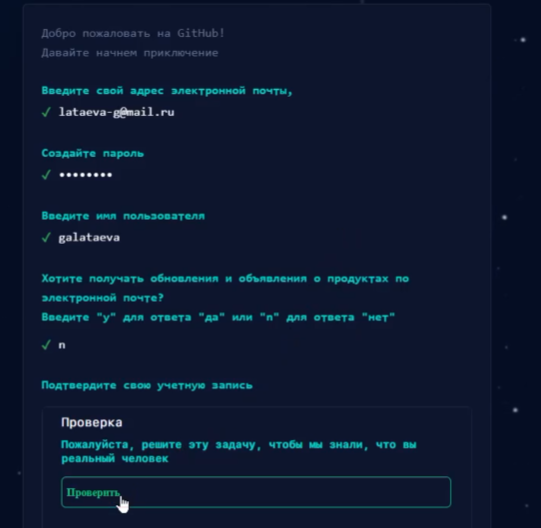{#fig:001 width=70%}

**2) Установка программного обеспечения**

- Установка git-flow: сначала необходимо установить makecache а потом уже сам gitflow

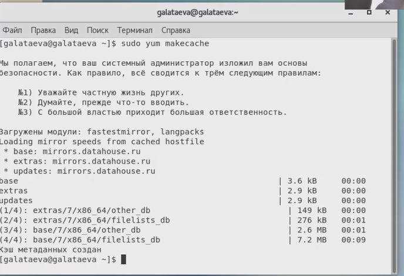{#fig:002 width=70%}

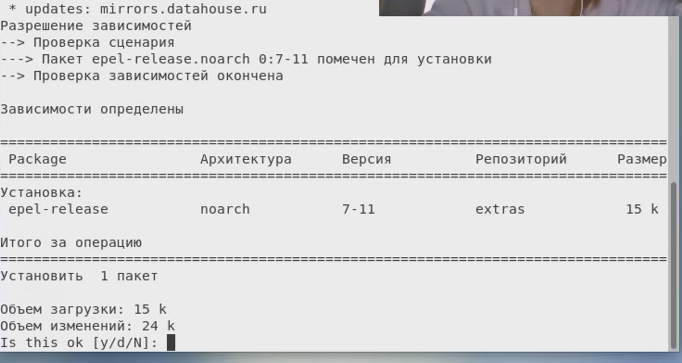{#fig:003 width=70%}

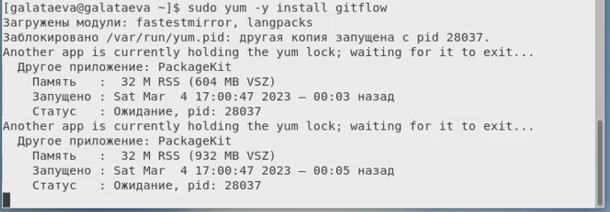{#fig:004 width=70%}

- Установка gh: на Centos 7 необходимо провести ряд манипуляций перед тем, как установить gh

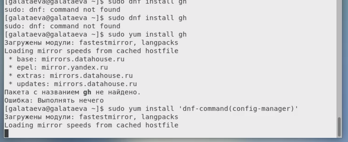{#fig:005 width=70%}

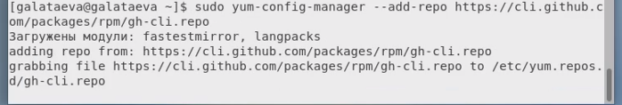{#fig:006 width=70%}

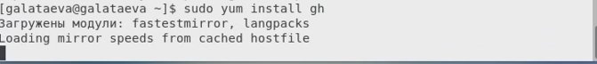{#fig:007 width=70%}

**3) Базовая настройка git**

Тут мы задали имя пользователя, почту и настроили utf-8 в выводе сообщений

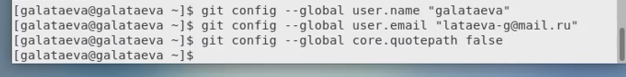{#fig:008 width=70%}

**4) Зададим имя начальной ветки:**

{#fig:009 width=70%}

{#fig:010 width=70%}

**5) Создаем ключи ssh**

- по алгоритму rsa с ключём размером 4096 бит:

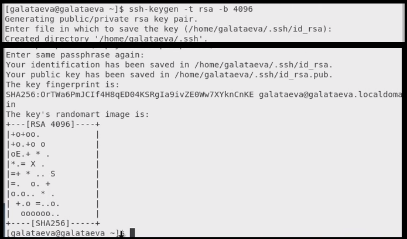{#fig:011 width=70%}

- по алгоритму ed25519:

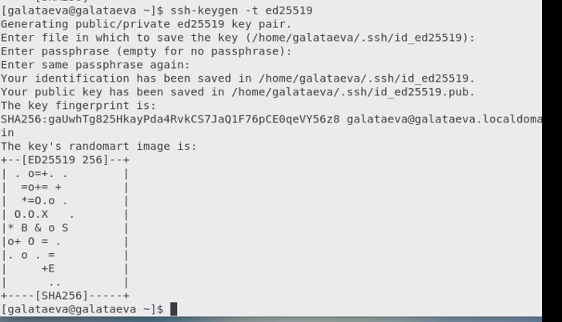{#fig:012 width=70%}

**6) Создаем ключи pgp**

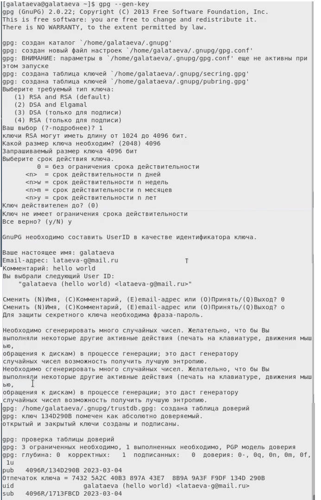{#fig:013 width=70%}

**7) Добавляем PGP ключ в GitHub**

- Выводим список ключей:

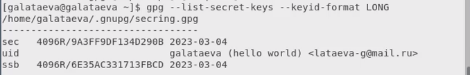{#fig:014 width=70%}

- Выводим ключ:

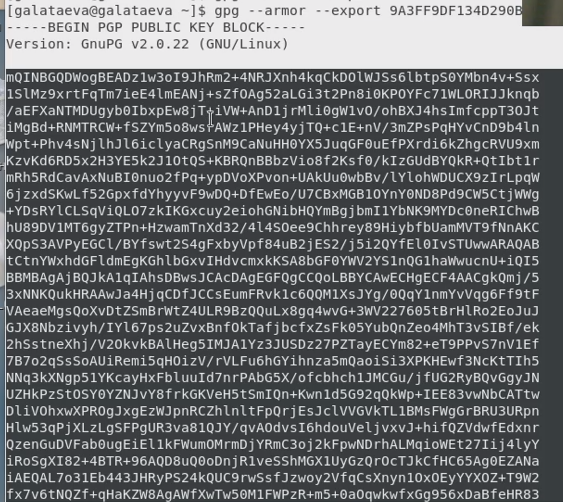{#fig:015 width=70%}

- Вставляем полученный ключ на сайте:

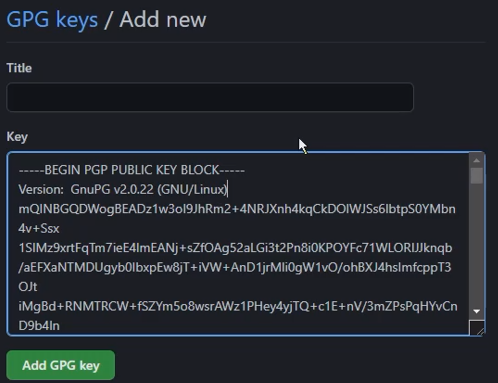{#fig:016 width=70%}

**8) Настраиваем автоматические подписи коммитов git**

{#fig:017 width=70%}

**9) Создаем репозиториий курса на основе шаблона**

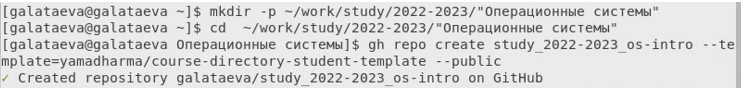{#fig:018 width=70%}

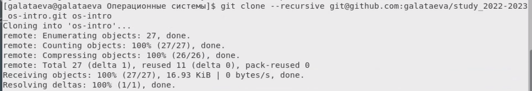{#fig:019 width=70%}

**10) Настраиваем каталог курса**

{#fig:020 width=70%}

{#fig:021 width=70%}

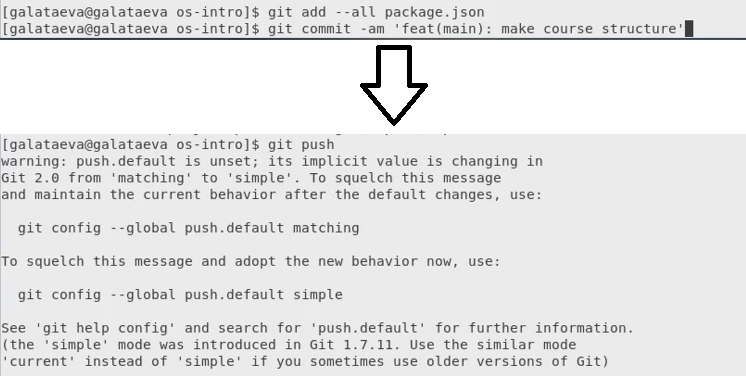{#fig:022 width=70%}

# Заключение

Я изучила применение средств контроля версий и в какой-то мере освоила навыки по работе с git.

# Контрольные вопросы

*1. Что такое системы контроля версий (VCS) и для решения каких задач они предназначаются?*

Система контроля версий (от англ. Version Control System, VCS) — это, грубо говоря, место хранения кода. Она создана для разработки продуктов: на хранение кода, синхронизацию работы нескольких человек, создание релизов и т.д. 

*2. Объясните следующие понятия VCS и их отношения: хранилище, commit, история, рабочая копия.*

Хранилище (репозиторий) – это хранилище всех версий кода. Он бывает трех видов: 
Локальный — расположен на одном компьютере, и работать с ним может только один человек. 
Централизованный — расположен на сервере, куда имеют доступ сразу несколько программистов. 
Распределенный — самый удобный вариант с облачным хранилищем. Главный репозиторий хранится в облаке, а его локальные копии — у разработчиков на компьютерах. 

Commit - запись изменений. 

История - список предыдущих изменений. 

Рабочая копия – текущее состояние файлов проекта, основанное на версии из хранилища (обычно на последней).

Рабочую копию получают из репозитория. Изменения вносятся в рабочую версию, потом посредством коммитов они заносятся в хранилище. История позволяет просмотреть изменения, которые вносились в репозиторий.

*3. Что представляют собой и чем отличаются централизованные и децентрализованные VCS? Приведите примеры VCS каждого вида.*

См. ответ на вопрос 1.

Среди централизованных VCS наиболее известны CVS, Subversion, а среди распределённых — Git, Bazaar, Mercurial.

*4. Опишите действия с VCS при единоличной работе с хранилищем.*

1) Получение нужной рабочей копии

2) Внесение в неё необходых изменений 

3) Сделать нужный коммит.

*5. Опишите порядок работы с общим хранилищем VCS.*

См. ответ на вопрос 4 + можно объединить/отменить внесённые другими пользователями изменения, или заблокировать некоторые файлы для изменения ими.

*6. Каковы основные задачи, решаемые инструментальным средством git?*

У Git две основных задачи: первая — хранить информацию о всех изменениях в коде, начиная с самой первой строчки, а вторая — обеспечение удобства командной работы над кодом.

*7. Назовите и дайте краткую характеристику командам git.*

git init - инициализация репозитория

git status - проверка статуса репозитория

git pull - получение обновлений (изменений)

git push - отправка изменений

git diff - просмотр текущих изменений

git add . -добавить все изменения 

git add имена_файлов - добавить конкретные изменения

git rm имена_файлов - удалить файл и/или каталог из репозитория

git commit -am 'Описание коммита' - сохранение всех добавленных изменений

git log –p - просмотр истории коммитов с изменениями

git branch - просмотр списка веток

git branch -d имя_ветки - удаление ветки

git branch имя_ветки - создание новой ветки

git merge имя_ветки – слияние ветки с основной

git merge origin - слияние удалённого репозитория с локальным

git push -u origin имя_ветки - отправка новой ветки в удалённый репозиторий

*8. Приведите примеры использования при работе с локальным и удалённым репозиториями.*

*9. Что такое и зачем могут быть нужны ветви (branches)?*

Система контроля версий может поддерживать работу с несколькими версиями одного файла, сохраняя общую историю изменений до точки ветвления версий и собственные истории изменений каждой ветви. Это удобно при работе над одним проектом нескольких человек.

*10. Как и зачем можно игнорировать некоторые файлы при commit?*

Игнорируемые файлы отслеживаются в специальном файле .gitignore, который регистрируется в корневом каталоге репозитория. В Git нет специальной команды для указания игнорируемых файлов: вместо этого необходимо вручную отредактировать файл .gitignore, чтобы указать в нем новые файлы, которые должны быть проигнорированы. Файлы .gitignore содержат шаблоны, которые сопоставляются с именами файлов в репозитории для определения необходимости игнорировать эти файлы.
Игнорируемые файлы — это, как правило, артефакты сборки и файлы, генерируемые машиной из исходных файлов в вашем репозитории, либо файлы, которые по какой-либо иной причине не должны попадать в коммиты.

