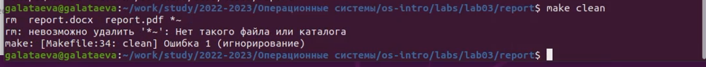
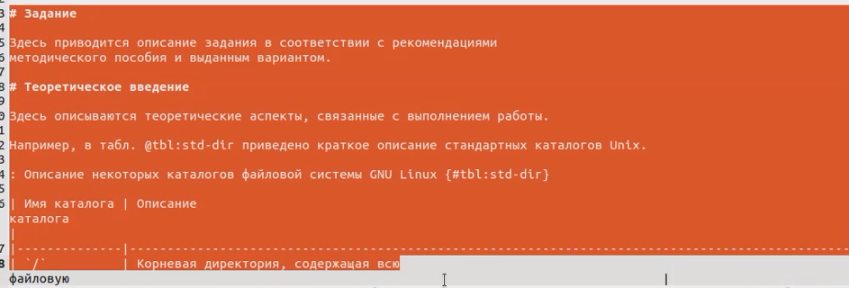
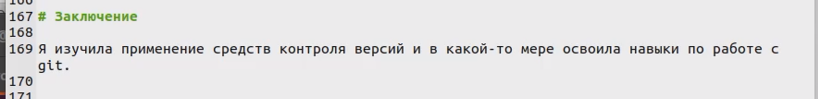
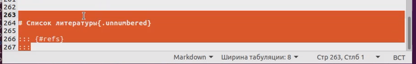
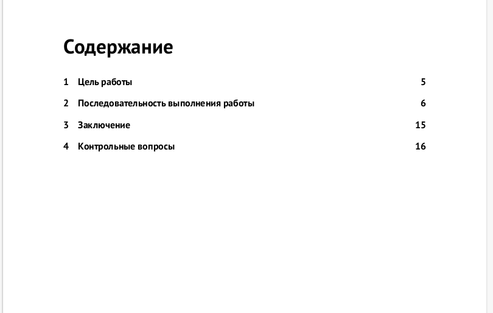
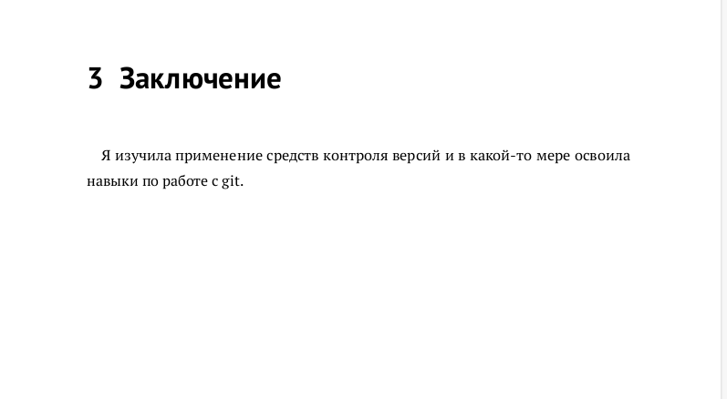

---
## Front matter
title: "Отчёт по лабораторной работе №3"
subtitle: "дисциплина:	Операционные системы"
author: "Латаева Гюзелия Андреевна"

## Generic otions
lang: ru-RU
toc-title: "Содержание"

## Bibliography
bibliography: bib/cite.bib
csl: pandoc/csl/gost-r-7-0-5-2008-numeric.csl

## Pdf output format
toc: true # Table of contents
toc-depth: 2
lof: true # List of figures
lot: true # List of tables
fontsize: 12pt
linestretch: 1.5
papersize: a4
documentclass: scrreprt
## I18n polyglossia
polyglossia-lang:
  name: russian
  options:
	- spelling=modern
	- babelshorthands=true
polyglossia-otherlangs:
  name: english
## I18n babel
babel-lang: russian
babel-otherlangs: english
## Fonts
mainfont: PT Serif
romanfont: PT Serif
sansfont: PT Sans
monofont: PT Mono
mainfontoptions: Ligatures=TeX
romanfontoptions: Ligatures=TeX
sansfontoptions: Ligatures=TeX,Scale=MatchLowercase
monofontoptions: Scale=MatchLowercase,Scale=0.9
## Biblatex
biblatex: true
biblio-style: "gost-numeric"
biblatexoptions:
  - parentracker=true
  - backend=biber
  - hyperref=auto
  - language=auto
  - autolang=other*
  - citestyle=gost-numeric
## Pandoc-crossref LaTeX customization
figureTitle: "Рис."
tableTitle: "Таблица"
listingTitle: "Листинг"
lofTitle: "Список иллюстраций"
lotTitle: "Список таблиц"
lolTitle: "Листинги"
## Misc options
indent: true
header-includes:
  - \usepackage{indentfirst}
  - \usepackage{float} # keep figures where there are in the text
  - \floatplacement{figure}{H} # keep figures where there are in the text
---

# Цель работы

Научиться оформлять отчёты с помощью легковесного языка разметки Markdown

# Задание

Сделайть отчёт по предыдущей лабораторной работе в формате Markdown.

# Теоретическое введение

Markdown - облегчённый язык разметки, созданный с целью обозначения форматирования в простом тексте, с максимальным сохранением его читаемости человеком, и пригодный для машинного преобразования в языки для продвинутых публикаций (HTML, Rich Text и других).

# Выполнение лабораторной работы

**1) Переходим в каталог с шаблоном отчета по лабораторной работе № 3 и проведим компиляцию шаблона с использованием Makefile (рис. @fig:001).**

{#fig:001 width=90%}

**2) Удаляем полученные файлы с использованием Makefile (рис. @fig:002).**

{#fig:002 width=90%}

**3) Редактируем отчет**

- Титульный лист (рис. @fig:003):

{#fig:003 width=90%}

- Цель работы (рис. @fig:004):

{#fig:004 width=90%}

- Выделяем и удаляем "Задание" и "Теоретическое введение" т.к. в отчете по лаб.2 они отсутствуют (рис. @fig:005), (рис. @fig:006):

{#fig:005 width=90%}

{#fig:006 width=90%}

- Переименовываем "Выполнение лабораторной работы" в "Последовательность выполнения работ" и редакируем этот пункт (рис. @fig:007):

{#fig:007 width=90%}

- Заключение (рис. @fig:008):

{#fig:008 width=90%}

- Добавляем и заполняем пункт "Контрольные вопросы" (рис. @fig:009):

{#fig:009 width=90%}

- Удаляем пункт "Список литературы", т.к. в отчете по лаб.2 он отсутствует (рис. @fig:010):

{#fig:010 width=90%}

**3) Просмотр результата**

- Титульный лист (рис. @fig:011):

{#fig:011 width=90%}

- Содержание (рис. @fig:012):

{#fig:012 width=90%}

- Список иллюстраций (рис. @fig:013):

{#fig:013 width=90%}

- Цель работы (рис. @fig:014):

{#fig:014 width=90%}

- Последовательность выполнения работ (рис. @fig:015)

{#fig:015 width=90%}

- Заключение (рис. @fig:016):

{#fig:016 width=90%}

- Контрольные вопросы (рис. @fig:017):

{#fig:017 width=90%}

# Выводы

Я научилась оформлять отчёты с помощью легковесного языка разметки Markdown

# Список литературы
https://ru.wikipedia.org/wiki/Markdown
