---
## Front matter
title: "Отчёт по лабораторной работе № 4"
subtitle: "дисциплина:	Операционные системы"
author: "Латаева Гюзелия Андреевна"

## Generic otions
lang: ru-RU
toc-title: "Содержание"

## Bibliography
bibliography: bib/cite.bib
csl: pandoc/csl/gost-r-7-0-5-2008-numeric.csl

## Pdf output format
toc: true # Table of contents
toc-depth: 2
lof: true # List of figures
lot: true # List of tables
fontsize: 12pt
linestretch: 1.5
papersize: a4
documentclass: scrreprt
## I18n polyglossia
polyglossia-lang:
  name: russian
  options:
	- spelling=modern
	- babelshorthands=true
polyglossia-otherlangs:
  name: english
## I18n babel
babel-lang: russian
babel-otherlangs: english
## Fonts
mainfont: PT Serif
romanfont: PT Serif
sansfont: PT Sans
monofont: PT Mono
mainfontoptions: Ligatures=TeX
romanfontoptions: Ligatures=TeX
sansfontoptions: Ligatures=TeX,Scale=MatchLowercase
monofontoptions: Scale=MatchLowercase,Scale=0.9
## Biblatex
biblatex: true
biblio-style: "gost-numeric"
biblatexoptions:
  - parentracker=true
  - backend=biber
  - hyperref=auto
  - language=auto
  - autolang=other*
  - citestyle=gost-numeric
## Pandoc-crossref LaTeX customization
figureTitle: "Рис."
tableTitle: "Таблица"
listingTitle: "Листинг"
lofTitle: "Список иллюстраций"
lotTitle: "Список таблиц"
lolTitle: "Листинги"
## Misc options
indent: true
header-includes:
  - \usepackage{indentfirst}
  - \usepackage{float} # keep figures where there are in the text
  - \floatplacement{figure}{H} # keep figures where there are in the text
---

# Цель работы

Познакомиться с операционной системой Linux, получить практические навыки работы с консолью и некоторыми графическими менеджерами рабочих столов операционной системы.

# Задание

1. Ознакомиться с теоретическим материалом.
2. Перейти на текстовую консоль.
3. Перемещаться между текстовыми консолями.
4. Зарегистрироваться в текстовой консоли операционной системы.
5. Завершить консольный сеанс.
6. Переключиться на графический интерфейс.
7. Ознакомиться с менеджером рабочих столов.
8. Поочерёдно зарегистрироваться в разных графических менеджерах рабочих столов (GNOME, KDE, XFCE) и оконных менеджерах (Openbox). Продемонстрировать разницу между ними, сделав снимки экрана (скриншоты).
9. Изучить список установленных программ. Запустить поочерёдно браузер, текстовый редактор, текстовый процессор, эмулятор консоли.

# Теоретическое введение

**Linux** — многопользовательская операционная система, т.е. несколько пользователей могут работать с ней одновременно с помощью терминалов.

**Компьютерный терминал** - устройство ввода–вывода, основные функции которого заключаются в вводе и отображении данных.

**Текстовый терминал** (терминал, текстовая консоль) - интерфейс компьютера для последовательной передачи данных.

**Виртуальные консоли** - реализация концепции многотерминальной работы в рамках одного устройства.

**Toolkit** (Tk, «набор инструментов», «инструментарий») - кроссплатформенная библиотека базовых элементов графического интерфейса, распространяемая с открытыми исходными текстами.

Процедура регистрации в системе обязательна для Linux. Каждый пользователь операционный системы имеет определенные ограничения на возможные с его стороны действия: чтение, изменение, запуск файлов, а также на ресурсы: пространство на файловой системе, процессорное время для выполнение текущих задач (процессов). При этом действия одного пользователя не влияют на работу другого. Такая модель разграничения доступа к ресурсам операционной системы получила название многопользовательской.

В многопользовательской модели пользователи делятся на пользователей с обычными правами и администраторов. Пользователь с обычными правами может производить действия с элементами операционной системы только в рамках выделенного ему пространства и ресурсов, не влияя на жизнеспособность самой операционной системы и работу других пользователей. Полномочия же пользователей с административными правами обычно не ограничены.

Для каждого пользователя организуется домашний каталог, где хранятся его данные и настройки рабочей среды. Доступ других пользователей с обычными правами к этому каталогу ограничивается.

Учётная запись пользователя содержит:

– входное имя пользователя (Login Name);

– пароль (Password);

– внутренний идентификатор пользователя (User ID);

– идентификатор группы (Group ID);

– анкетные данные пользователя (General Information);

– домашний каталог (Home Dir);

– указатель на программную оболочку (Shell).

Учётные записи пользователей хранятся в файле /etc/passwd, который имеет следующую структуру: login:password:UID:GID:GECOS:home:shell

На компьютерах с операционной системой типа Linux может быть установлено несколько графических сред.

# Выполнение лабораторной работы

С теоретическим материалом ознакомилась и загрузила виртуальную машину.

**Текстовые консоли** 

Мне доступно 4 текстовых консоли (рис. @fig:001, @fig:002, @fig:003, @fig:004):

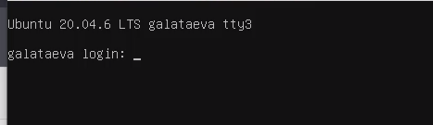{#fig:001 width=70%}

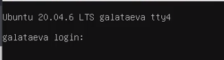{#fig:002 width=70%}

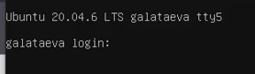{#fig:003 width=70%}

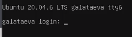{#fig:004 width=70%}

Для перемещения между ними я использовала комбинации клавиш Ctrl + Alt + F(3-6)

Для того чтобы зарегистрироваться в текстовой консоли операционной системы я использовала логин, который использую при входе в систему а при вводе пароля не отображаются символы (рис. @fig:005).

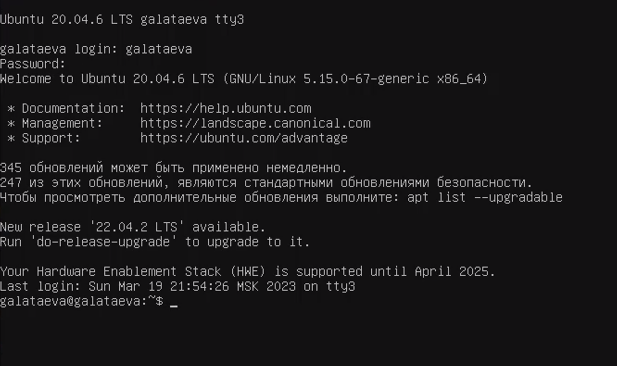{#fig:005 width=70%}

Чтобы завершить консольный сеанс  использовала комбинацию Ctrl + D, а для перемещения на графический интерфейс я использовала Ctrl + Alt + F1 или Ctrl + Alt + F2.

**Графический интерфейс** 

Чтобы узнать менеджер рабочего стола я ввела комманду echo $XDG_CURRENT_DESKTOP (рис. @fig:006).

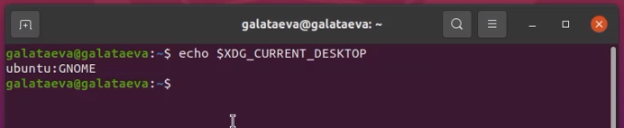{#fig:006 width=70%}

У меня отсутствовали какие-либо дополнительные менеджеры рабочих столов, прищлось скачать XFCE. После скачивания в окне авторизации в системе появился выбор, какой рабочий стол запустить (рис. @fig:007):

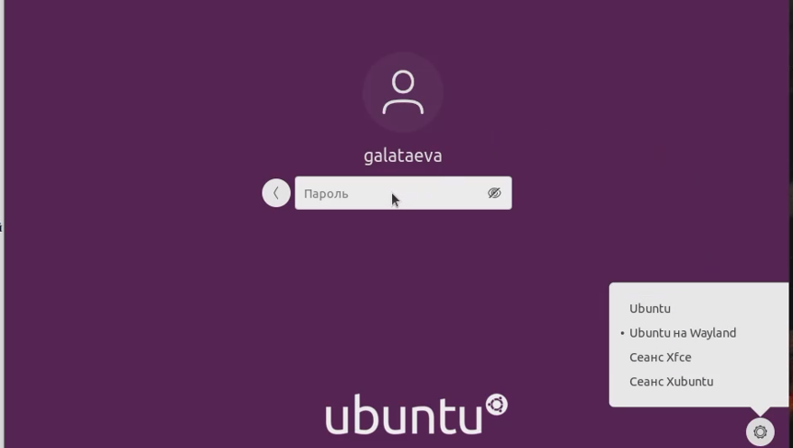{#fig:007 width=70%}

Запустим терминал (рис. @fig:009): 

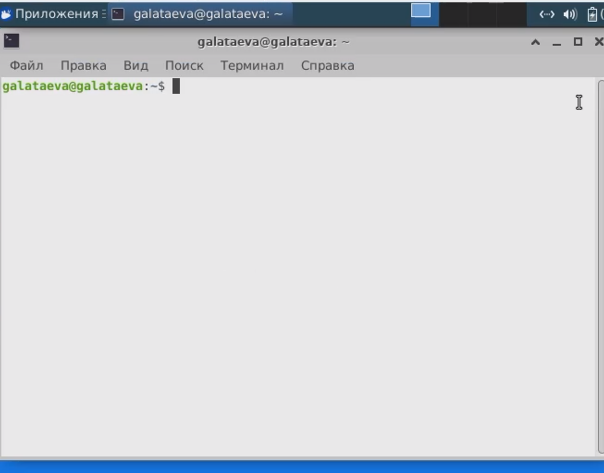{#fig:008 width=70%}

-Сравнение меню Ubuntu (рис. @fig:009) и XFCE (рис. @fig:010):

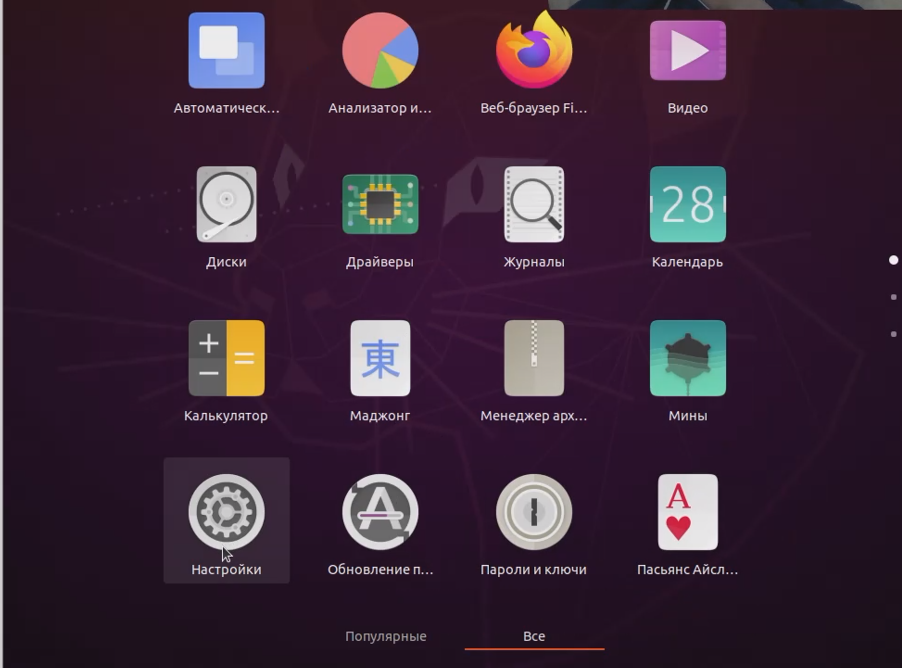{#fig:009 width=70%}

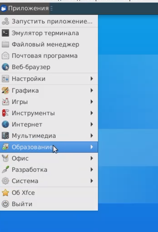{#fig:010 width=70%}

-Браузеры (рис. @fig:011) и (рис. @fig:012)

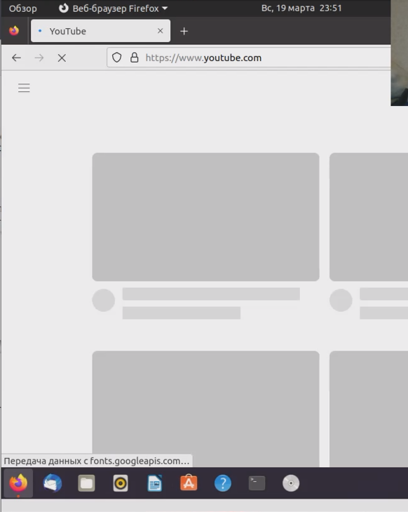{#fig:011 width=70%}

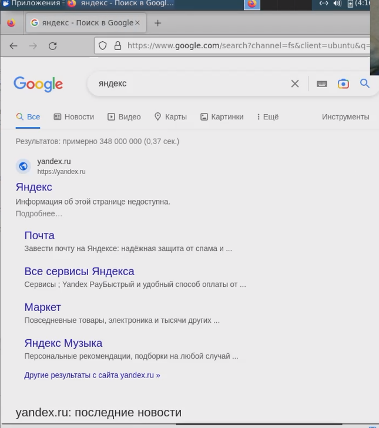{#fig:012 width=70%}

-Текстовые редакторы (рис. @fig:013), (рис. @fig:014), (рис. @fig:015), (рис. @fig:016):

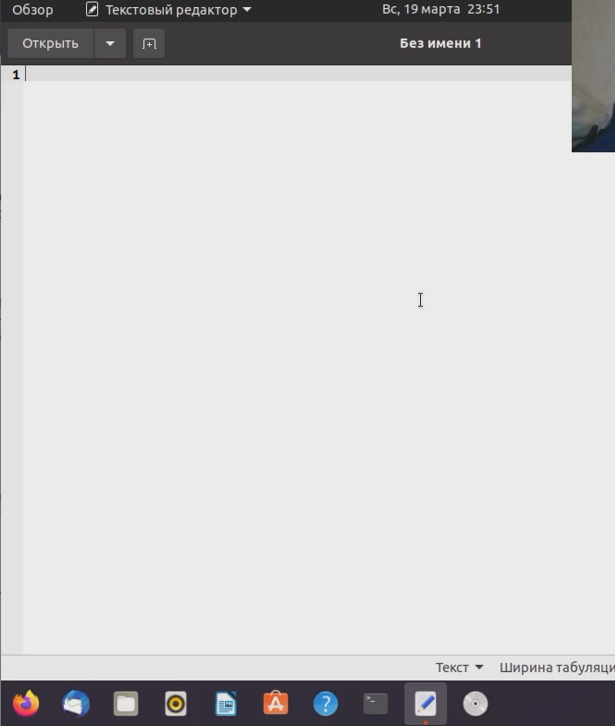{#fig:013 width=70%}

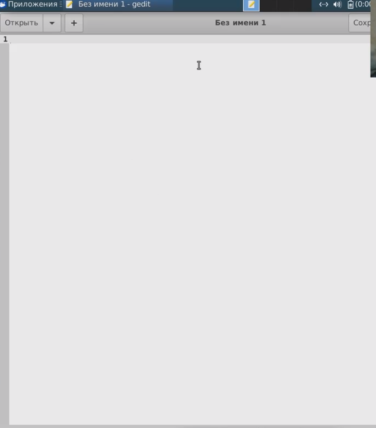{#fig:014 width=70%}

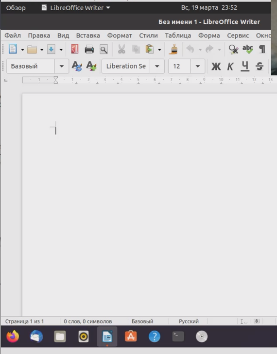{#fig:015 width=70%}

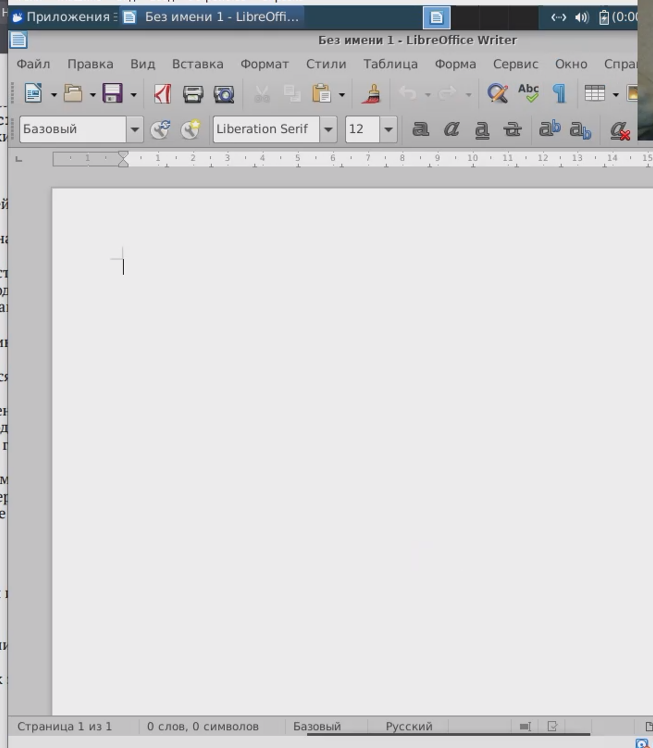{#fig:016 width=70%}

# Выводы

Я познакомилась с операционной системой Linux и получить практические навыки работы с консолью, графическим менеджером рабочих столов операционной системы XFCE.

# Контрольные вопросы
*1. Что такое компьютерный терминал? Есть ли, по вашему мнению, у него преимущества перед графическим интерфейсом?*

Компьютерный терминал — устройство ввода/вывода, основные функции которого заключаются в вводе и отображении данных. В ряде проектов с открытым исходным кодом разработчики обычно сначала предоставляют своим приложениям доступ из командной строки. Позже они могут предоставить поддержку графического интерфейса. Графический интерфейс не всегда поставляется со всеми параметрами, доступными в приложении командной строки. Более того, если есть необходимость пользоваться преимуществами приложения, не дожидаясь появления графического интерфейса, безусловно, понадобится удобная командная строка.

*2. Что такое входное имя пользователя?*

Это Login — название учётной записи пользователя.

*3. В каком файле хранятся пароли пользователей? В каком виде они хранятся?*

Из соображений безопасности все пароли были перенесены в специальный файл /etc/shadow, недоступный для чтения обычным пользователям. Хранится хеш.

*4. Где хранятся настройки пользовательских программ?*

В домашнем каталоге.

*5. Какое входное имя у администратора ОС Unix?*

Учётная запись пользователя с UID=0 называется root и присутствует в любой системе типа Linux. 

*6. Имеет ли администратор доступ к настройкам пользователей?*

Да.

*7. Каковы основные характеристики многопользовательской модели разграничения доступа?*

Процедура регистрации в системе обязательна для Linux. Каждый пользователь операционный системы имеет определенные ограничения на возможные с его стороны действия: чтение, изменение, запуск файлов, а также на ресурсы: пространство на файловой системе, процессорное время для выполнение текущих задач (процессов). При этом действия одного пользователя не влияют на работу другого. Такая модель разграничения доступа к ресурсам операционной системы получила название многопользовательской.

*8. Какую информацию кроме пароля и логина содержит учётная запись пользователя?*

внутренний идентификатор пользователя (User ID), идентификатор группы (Group ID), анкетные данные пользователя (General Information), домашний каталог (Home Dir), указатель на программную оболочку (Shell).

*9. Что такое UID и GID? Расшифруйте эти аббревиатуры.*

User ID — внутренний идентификатор пользователя и Group ID — идентификатор группы.

*10. Что такое GECOS?*

Анкетные данные пользователя (General Information)являются необязательным параметром учётной записи и могут содержать реальное имя пользователя, адрес, телефон.

*11. Что такое домашний каталог? Какие файлы хранятся в нем?*

В домашнем каталоге пользователя хранятся данные (файлы) пользователя, настройки рабочего стола и других приложений. Содержимое домашнего каталога обычно не доступно другим пользователям с обычными правами и не влияет на работу и настройки рабочей среды других пользователей.

*12. Как называется ваш домашний каталог?*

galataeva.

*13. Имеет ли администратор возможность изменить содержимое домашнего каталога пользователя?*

Да.

*14. Что хранится в файле /etc/passwd?*

Учётные записи пользователей.

*15. Как, просмотрев содержимое файла /etc/passwd, узнать, какие пользователи не смогут войти в систему?*

Символ * в поле password некоторой учётной записи в файле /etc/passwd означает, что пользователь не сможет войти в систему

*16. Что такое виртуальные консоли? Как вы думаете, что означает слово «виртуальный» в данном контексте?*

Виртуальные консоли — реализация концепции многотерминальной работы в рамках одного устройства. Виртуальный означает, что можно выполнять много действий в одном окне со многими папками.

*17. Зачем нужна программа getty?*

getty (сокращение от get teletype) — программа для UNIX-подобных операционных систем, управляющая доступом к физическим и виртуальным терминалам (tty).

*18. Что такое сеанс работы?*

Весь процесс взаимодействия пользователя с системой с момента регистрации до выхода.

*19. Что такое тулкит?*

Кроссплатформенная библиотека базовых элементов графического интерфейса, распространяемая с открытыми исходными текстами

*20. Какие основные тулкиты существуют в системе Unix?*

GTK+ (сокращение от GIMP Toolkit), Qt.
GTK+ состоит из двух компонентов: 1.GTK — содержит набор элементов пользовательского интерфейса (таких, как кнопка, список, поле для ввода текста и т. п.) для различных задач; 2.GDK — отвечает за вывод информации на экран, может использовать для этого X Window System, Linux Framebuffer, WinAPI.

# Список литературы{.unnumbered}

1. https://www.google.ru/
