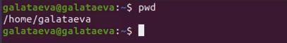
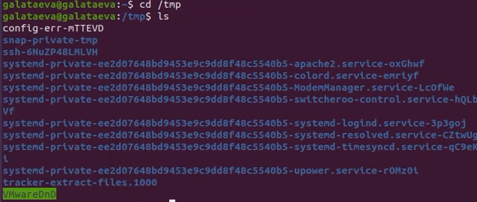
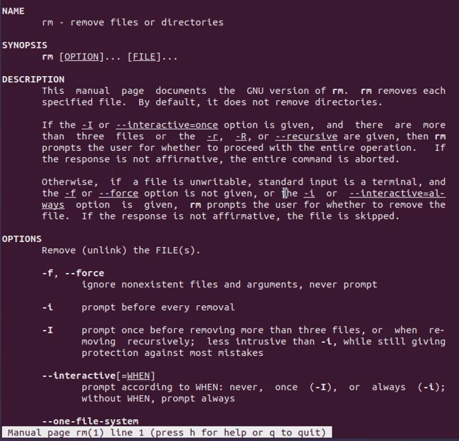

---
## Front matter
title: "Отчёт по лабораторной работе №5"
subtitle: "дисциплина:	Операционные системы"
author: "Латаева Гюзелия Андреевна"

## Generic otions
lang: ru-RU
toc-title: "Содержание"

## Bibliography
bibliography: bib/cite.bib
csl: pandoc/csl/gost-r-7-0-5-2008-numeric.csl

## Pdf output format
toc: true # Table of contents
toc-depth: 2
lof: true # List of figures
lot: true # List of tables
fontsize: 12pt
linestretch: 1.5
papersize: a4
documentclass: scrreprt
## I18n polyglossia
polyglossia-lang:
  name: russian
  options:
	- spelling=modern
	- babelshorthands=true
polyglossia-otherlangs:
  name: english
## I18n babel
babel-lang: russian
babel-otherlangs: english
## Fonts
mainfont: PT Serif
romanfont: PT Serif
sansfont: PT Sans
monofont: PT Mono
mainfontoptions: Ligatures=TeX
romanfontoptions: Ligatures=TeX
sansfontoptions: Ligatures=TeX,Scale=MatchLowercase
monofontoptions: Scale=MatchLowercase,Scale=0.9
## Biblatex
biblatex: true
biblio-style: "gost-numeric"
biblatexoptions:
  - parentracker=true
  - backend=biber
  - hyperref=auto
  - language=auto
  - autolang=other*
  - citestyle=gost-numeric
## Pandoc-crossref LaTeX customization
figureTitle: "Рис."
tableTitle: "Таблица"
listingTitle: "Листинг"
lofTitle: "Список иллюстраций"
lotTitle: "Список таблиц"
lolTitle: "Листинги"
## Misc options
indent: true
header-includes:
  - \usepackage{indentfirst}
  - \usepackage{float} # keep figures where there are in the text
  - \floatplacement{figure}{H} # keep figures where there are in the text
---

# Цель работы

Приобретение практических навыков взаимодействия пользователя с системой посредством командной строки.

# Задание

1. Определить полное имя домашнего каталога. Далее относительно этого каталога будут выполняться последующие упражнения.
2. Выполнить следующие действия:
   1. Перейти в каталог /tmp.
   2. Вывести на экран содержимое каталога /tmp. Для этого использовать команду ls с различными опциями. Пояснить разницу в выводимой на экран информации.
   3. Определить, есть ли в каталоге /var/spool подкаталог с именем cron?
   4. Перейти в домашний каталог и вывести на экран его содержимое. Определить, кто является владельцем файлов и подкаталогов?
3. Выполнить следующие действия:
   1. В домашнем каталоге создать новый каталог с именем newdir.
   2. В каталоге ~/newdir создать новый каталог с именем morefun.
   3. В домашнем каталоге создать одной командой три новых каталога с именами letters, memos, misk. Затем удалить эти каталоги одной командой.
   4. Попробовать удалить ранее созданный каталог ~/newdir командой rm. Проверить, был ли каталог удалён.
   5. Удалить каталог ~/newdir/morefun из домашнего каталога. Проверить, был ли каталог удалён.
4. С помощью команды man определить, какую опцию команды ls нужно использовать для просмотра содержимого не только указанного каталога, но и подкаталогов, входящих в него.
5. С помощью команды man определить набор опций команды ls, позволяющий отсортировать по времени последнего изменения выводимый список содержимого каталога с развёрнутым описанием файлов.
6. Использоватт команду man для просмотра описания следующих команд: cd, pwd, mkdir, rmdir, rm. Пояснить основные опции этих команд.
7. Используя информацию, полученную при помощи команды history, выполнить модификацию и исполнение нескольких команд из буфера команд.

# Теоретическое введение

В операционной системе типа Linux взаимодействие пользователя с системой обычно осуществляется с помощью командной строки посредством построчного ввода команд. При этом обычно используется командные интерпретаторы языка shell: */bin/sh; /bin/csh; /bin/ksh.*

Командой в операционной системе называется записанный по специальным правилам текст (возможно с аргументами), представляющий собой указание на выполнение каких-либо функций (или действий) в операционной системе. Обычно первым словом идёт имя команды, остальной текст — аргументы или опции, конкретизирующие действие.

Общий формат команд можно представить следующим образом: 

*[имя_команды][разделитель][аргументы]*

**Команда man.** Команда man используется для просмотра в диалоговом режиме руководства (manual) по основным командам операционной системы типа Linux.

Формат команды: *man [команда]*

**Команда cd.** Команда cd используется для перемещения по файловой системе операционной системы типа Linux. 

Формат команды: cd *[путь_к_каталогу]*

**Команда pwd.** Для определения абсолютного пути к текущему каталогу используется команда pwd.

**Команда ls.** Команда ls используется для просмотра содержимого каталога.

Формат команды: *ls [-опции] [путь]*

**Команда mkdir.** Команда mkdir используется для создания каталогов.

Формат команды: *mkdir имя_каталога1 [имя_каталога2...]*

**Команда rm.** Команда rm используется для удаления файлов и/или каталогов.

Формат команды: *rm [-опции] [файл]*

**Команда history.** Для вывода на экран списка ранее выполненных команд используется команда history. Выводимые на экран команды в списке нумеруются. К любой команде из выведенного на экран списка можно обратиться по её номеру в списке, воспользовавшись конструкцией *![номер_команды]*.
Можно модифицировать команду из выведенного на экран списка при помощи
следующей конструкции: *![номер_команды]:s/[что_меняем]/[на_что_меняем]*

**Использование символа «;».** Если требуется выполнить последовательно несколько команд, записанный в одной строке, то для этого используется символ точка с запятой.

# Выполнение лабораторной работы

1. Определим полное имя домашнего каталога (рис. @fig:001):

{#fig:001 width=70%}

2. Перейдем в каталог /tmp и выведем на экран содержимое каталога (рис. @fig:002): 

{#fig:002 width=70%}

ls -a (просмотр содержимого и скрытых файлов) (рис. @fig:003):

{#fig:003 width=70%}

ls -F (просмотр содержимого с типом файлов) (рис. @fig:004):

{#fig:004 width=70%}

ls -l (просмотр содержимого с подробным описанием) (рис. @fig:005): 

{#fig:005 width=70%}

3. Определим, есть ли в каталоге /var/spool подкаталог с именем cron (рис. @fig:006): 

{#fig:006 width=70%}

Вывод: есть.

4. Перейдем в домашний каталог и выведем на экран его содержимое (рис. @fig:007): 

{#fig:007 width=70%}

Как видно, вледельцем файлов и каталогов являюсь я.

5. В домашнем каталоге создим новый каталог с именем newdir и в каталоге ~/newdir создадим новый каталог с именем morefun (рис. @fig:008):

{#fig:008 width=70%}

Удалим их (рис. @fig:010):

{#fig:010 width=70%}

6. В домашнем каталоге создим одной командой три новых каталога с именами letters, memos, misk. Затем удалим эти каталоги одной командой  (рис. @fig:009):

{#fig:009 width=70%}

7. С помощью команды man (рис. @fig:011) определим:

   1. Какую опцию команды ls нужно использовать для просмотра содержимого не только указанного каталога, но и подкаталогов, входящих в него (опция -R).
   2. Набор опций команды ls, позволяющий отсортировать по времени последнего изменения выводимый список содержимого каталога с развёрнутым описанием файлов (опции -ltc).

{#fig:011 width=70%}

8. Используем команду man для просмотра описания следующих команд: cd, pwd, mkdir, rmdir, rm.

- cd (рис. @fig:012):

{#fig:012 width=70%}

-P - позволяет следовать по символическим ссылкам перед тем, как будут обработаны все переходы ".."

-L - переходит по символическим ссылкам только после того, как были обработаны ".."

-e - если папку, в которую нужно перейти не удалось найти - выдает ошибку

- pwd (рис. @fig:013):

{#fig:013 width=70%}

-L, --logical - брать директорию из переменной окружения, даже если она содержит символические ссылки

-P - отбрасывать все символические ссылки

--help - отобразить справку по утилите

--version - отобразить версию утилиты

- mkdir (рис. @fig:014):

{#fig:014 width=70%}

-m (--mode=режим) - назначить режим доступа (права). По умолчанию mod принимает значение 0777, что обеспечивает неограниченные права

-p (--parents) - не показывать ошибки, а также их игнорировать

-z  (--context=CTX ) принимает контекст SELinux для каталога по умолчанию

-v (--verbose) - выводить сообщение о каждом новым каталоге

--help - вывести справочную информацию

--version - выводит информацию о текущей версии утилиты

- rmdir (рис. @fig:015): 

{#fig:015 width=70%}

-p - Если каталог включает более, чем один компонент пути, то удаляется каталог, затем убирается последний компонент пути и удаляется получившийся каталог и т. д. до тех пор, пока все компоненты не будут удалены

--ignore-fail-on-non-empty - Обычно rmdir будет отказываться удалять непустые каталоги. Данная опция заставляет rmdir игнорировать ошибки при удалении каталога, если эти ошибки вызваны тем, что каталог не пуст

--help - Выдать подсказку на стандартный вывод и успешно завершиться

--version - Выдать информацию о версии на стандартный вывод и успешно завершиться

- rm (рис. @fig:016):

{#fig:016 width=70%}

-f или --force - Игнорировать несуществующие файлы и аргументы. Никогда не выдавать запросы на подтверждение удаления

-i - Выводить запрос на подтверждение удаления каждого файла

-I - Выдать один запрос на подтверждение удаления всех файлов, если удаляется больше трех файлов или используется рекурсивное удаление. Опция применяется, как более «щадящая» версия опции -i

--interactive[=КОГДА] - Вместо КОГДА можно использовать:

never — никогда не выдавать запросы на подтверждение удаления

once — выводить запрос один раз (аналог опции -I)

always — выводить запрос всегда (аналог опции -i)

Если значение КОГДА не задано, то используется always

--one-file-system - Во время рекурсивного удаления пропускать директории, которые находятся на других файловых системах

--no-preserve-root - Если в качестве директории для удаления задан корневой раздел /, то считать, что это обычная директория и начать выполнять удаление

--preserve-root - Если в качестве директории для удаления задан корневой раздел /, то запретить выполнять команду rm над корневым разделом. Данное поведение используется по умолчанию

-r или -R или --recursive - Удаление директорий и их содержимого. Рекурсивное удаление

-d или --dir - Удалять пустые директории

-v или --verbose - Выводить информацию об удаляемых файлах

9. Используя информацию, полученную при помощи команды history (рис. @fig:017), выполним модификацию и исполнение нескольких команд из буфера команд (рис. @fig:018) и (рис. @fig:018).

{#fig:017 width=70%}

{#fig:018 width=70%}

{#fig:019 width=70%}

# Выводы

Я получила навыки взаимодействия пользователя с системой посредством командной строки.

# Контрольные вопросы

*1. Что такое командная строка?*

Командой в операционной системе называется записанный по специальным правилам текст (возможно с аргументами), представляющий собой указание на выполнение каких-либо функций (или действий) в операционной системе. 

*2. При помощи какой команды можно определить абсолютный путь текущего каталога? Приведите пример.*

Команда pwd. Пример: 

galataeva@galataeva:~/work/study/2022-2023/Операционные системы/os-intro/labs/la
b05/report$ pwd

/home/galataeva/work/study/2022-2023/Операционные системы/os-intro/labs/lab05/report

*3. При помощи какой команды и каких опций можно определить только тип файлов и их имена в текущем каталоге? Приведите примеры.*

Команда ls -F выведет имена файлов в текущем каталоге и их типы. Тип каталога обозначается /, тип исполняемого файла обозначается *, тип ссылки обозначается @. Пример: 

galataeva@galataeva:~/work/study/2022-2023/Операционные системы/os-intro/labs/la
b05/report$ ls -F

bib/  image/  Makefile  pandoc/  report.docx  report.md  report.pdf

*4. Какие файлы считаются скрытыми? Как получить информацию о скрытых файлах? Приведите примеры.*

Некоторые файлы в операционной системе скрыты от просмотра и обычно используются для настройки рабочей среды. Имена таких файлов начинаются с точки. Для того, чтобы отобразить имена скрытых файлов, необходимо использовать команду ls с опцией a: ls -a. Пример: 

galataeva@galataeva:~/work/study/2022-2023/Операционные системы/os-intro/labs/la
b05/report$ ls -a

.  ..  bib  image  Makefile  pandoc  report.docx  report.md  report.pdf

*5. При помощи каких команд можно удалить файл и каталог? Можно ли это сделать одной и той же командой? Приведите примеры.*

Команда rm используется для удаления файлов и/или каталогов. Команда rm -r необходима, чтобы удалить каталог, содержащий файлы. Без указания этой опции команда не будет выполняться. Если каталог пуст, то можно воспользоваться командой rmdir. Если удаляемый каталог содержит файлы, то команда не будет выполнена – нужно использовать «rm -r имя_каталога». Таким образом, каталог, не содержащий файлов, можно удалить и командой rm, и командой rmdir. Файл командой rmdir удалить нельзя. Пример (рис. @fig:010). 

*6. Как определить, какие команды выполнил пользователь в сеансе работы?*

Чтобы определить, какие команды выполнил пользователь в сеансе работы, необходимо воспользоваться командой «history».

*7. Каким образом можно исправить и запустить на выполнение команду, которую пользователь уже использовал в сеансе работы? Приведите примеры.*

Можно модифицировать команду из выведенного на экран списка при помощи следующей конструкции: *![номер_команды]:s/[что_меняем]/[на_что_меняем]*. Пример (рис. @fig:018) и (рис. @fig:018).

*8. Можно ли в одной строке записать несколько команд? Если да, то как? Приведите примеры.*

Чтобы записать в одной строке несколько команд, необходимо между ними поставить ;. Пример:

galataeva@galataeva:~/work/study/2022-2023/Операционные системы/os-intro/labs/la
b05$ cd report;ls

bib  image  Makefile  pandoc  report.docx  report.md  report.pdf

*9. Что такое символ экранирования? Приведите примеры использования этого символа.*

Символ обратного слэша \ позволяет использовать управляющие символы ( ".", "/", "$", "*", "[", "]", "^", "&") без их интерпретации командной оболочкой; процедура добавления данного символа перед управляющими символами называется экранированием символов. Например, команда «ls newdir/morefun» отобразит содержимое каталога newdir/morefun.

*10. Какая информация выводится на экран о файлах и каталогах, если используется опция l в команде ls?*

Тип файла, право доступа, число ссылок, владелец, размер, дата последней ревизии,

*11. Что такое относительный путь к файлу? Приведите примеры использования относительного и абсолютного пути при выполнении какой-либо команды.*

Абсолютный путь от корня файловой системы – этот путь начинается от корня "/" и описывает весь путь к файлу или каталогу.

Относительный путь – это путь к файлу относительно текущего каталога (каталога, где находится пользователь). 

Пример: 

Абсолютный:

galataeva@galataeva:~$ cd /home/galataeva/work/study/2022-2023/"Операционные системы"/os-intro/labs/lab05/report

galataeva@galataeva:~/work/study/2022-2023/Операционные системы/os-intro/labs/la
b05/report$ 

Относительный:

galataeva@galataeva:~$ cd work/study/2022-2023/"Операционные системы"/os-intro/labs/lab05/report

galataeva@galataeva:~/work/study/2022-2023/Операционные системы/os-intro/labs/la
b05/report$ 

*12. Как получить информацию об интересующей вас команде?*

Воспользоваться конструкцией *man [имя_команды]*.

*13. Какая клавиша или комбинация клавиш служит для автоматического дополнения вводимых команд?*

Клавиша Tab. 

# Список литературы{.unnumbered}

1. https://yandex.ru

