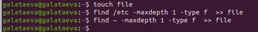
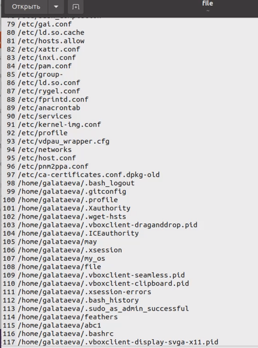
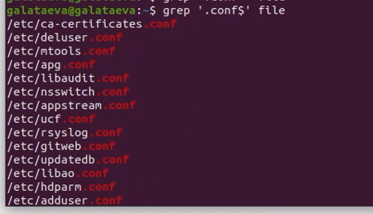
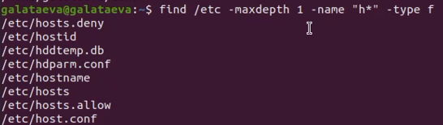
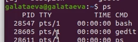
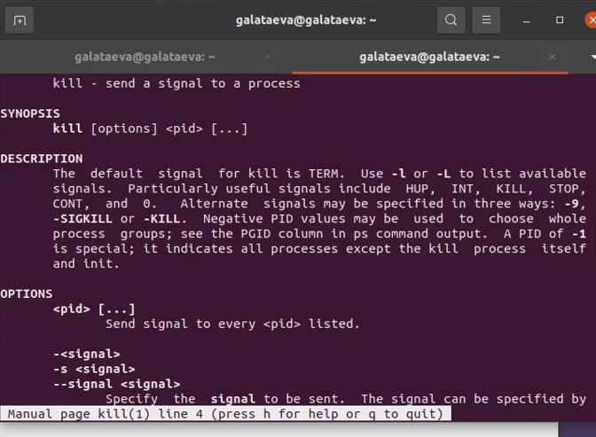
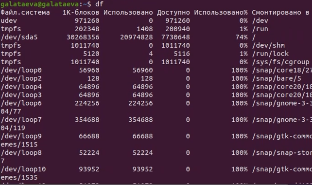
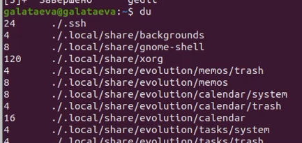
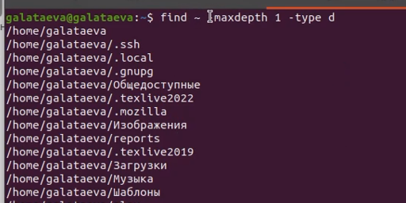

---
## Front matter
title: "Отчёт по лабораторной работе №7"
subtitle: "дисциплина: Операционные системы"
author: "Латаева Гюзелия Андреевна"

## Generic otions
lang: ru-RU
toc-title: "Содержание"

## Bibliography
bibliography: bib/cite.bib
csl: pandoc/csl/gost-r-7-0-5-2008-numeric.csl

## Pdf output format
toc: true # Table of contents
toc-depth: 2
lof: true # List of figures
lot: true # List of tables
fontsize: 12pt
linestretch: 1.5
papersize: a4
documentclass: scrreprt
## I18n polyglossia
polyglossia-lang:
  name: russian
  options:
	- spelling=modern
	- babelshorthands=true
polyglossia-otherlangs:
  name: english
## I18n babel
babel-lang: russian
babel-otherlangs: english
## Fonts
mainfont: PT Serif
romanfont: PT Serif
sansfont: PT Sans
monofont: PT Mono
mainfontoptions: Ligatures=TeX
romanfontoptions: Ligatures=TeX
sansfontoptions: Ligatures=TeX,Scale=MatchLowercase
monofontoptions: Scale=MatchLowercase,Scale=0.9
## Biblatex
biblatex: true
biblio-style: "gost-numeric"
biblatexoptions:
  - parentracker=true
  - backend=biber
  - hyperref=auto
  - language=auto
  - autolang=other*
  - citestyle=gost-numeric
## Pandoc-crossref LaTeX customization
figureTitle: "Рис."
tableTitle: "Таблица"
listingTitle: "Листинг"
lofTitle: "Список иллюстраций"
lotTitle: "Список таблиц"
lolTitle: "Листинги"
## Misc options
indent: true
header-includes:
  - \usepackage{indentfirst}
  - \usepackage{float} # keep figures where there are in the text
  - \floatplacement{figure}{H} # keep figures where there are in the text
---

# Цель работы

Ознакомление с инструментами поиска файлов и фильтрации текстовых данных. Приобретение практических навыков: по управлению процессами (и заданиями), по проверке использования диска и обслуживанию файловых систем.

# Задание

1. Осуществить вход в систему, используя соответствующее имя пользователя.
2. Записать в файл file.txt названия файлов, содержащихся в каталоге /etc. Дописать в этот же файл названия файлов, содержащихся в домашнем каталоге.
3. Вывести имена всех файлов из file.txt, имеющих расширение .conf, после чего записать их в новый текстовой файл conf.txt.
4. Определить, какие файлы в домашнем каталоге имеют имена, начинавшиеся с символа c? Предложить несколько вариантов, как это сделать.
5. Вывести на экран (по странично) имена файлов из каталога /etc, начинающиеся с символа h.
6. Запустить в фоновом режиме процесс, который будет записывать в файл ~/logfile файлы, имена которых начинаются с log.
7. Удалить файл ~/logfile.
8. Запустить из консоли в фоновом режиме редактор gedit.
9. Определить идентификатор процесса gedit, используя команду ps, конвейер и фильтр grep. Можно ли определить этот идентификатор более простым способом?
10. Прочесть справку (man) команды kill, после чего использовать её для завершения процесса gedit.
11. Выполнить команды df и du, предварительно получив более подробную информацию об этих командах, с помощью команды man.
12. Воспользовавшись справкой команды find, вывести имена всех директорий, имеющихся в домашнем каталоге.

# Теоретическое введение

В системе по умолчанию открыто три специальных потока:
–stdin — стандартный поток ввода (по умолчанию: клавиатура), файловый дескриптор 0;
–stdout — стандартный поток вывода (по умолчанию: консоль), файловый дескриптор 1;
–stderr — стандартный поток вывод сообщений об ошибках (по умолчанию: консоль), файловый дескриптор 2.

Большинство используемых в консоли команд и программ записывают результаты своей работы в стандартный поток вывода stdout. Например, команда ls выводит в стандартный поток вывода (консоль) список файлов в текущей директории. Потоки вывода и ввода можно перенаправлять на другие файлы или устройства. Проще всего это делается с помощью символов >, >>, <, <<. 

Конвейер (pipe) служит для объединения простых команд или утилит в цепочки, в которых результат работы предыдущей команды передаётся последующей. Синтаксис следующий: команда 1 | команда 2.

Команда find используется для поиска и отображения имён файлов, соответствующих заданной строке символов. Формат команды: find путь [-опции].

Найти в текстовом файле указанную строку символов позволяет команда grep. Формат команды: grep строка имя_файла.

Команда df показывает размер каждого смонтированного раздела диска. Формат команды: df [-опции] [файловая_система].

Команда du показывает число килобайт, используемое каждым файлом или каталогом. Формат команды: du [-опции] [имя_файла...].

Любую выполняющуюся в консоли команду или внешнюю программу можно запустить в фоновом режиме. Для этого следует в конце имени команды указать знак амперсанда &.

Любой команде, выполняемой в системе, присваивается идентификатор процесса (process ID). Получить информацию о процессе и управлять им, пользуясь идентификатором процесса, можно из любого окна командного интерпретатора.

Команда ps используется для получения информации о процессах. Формат команды: ps [-опции].

# Выполнение лабораторной работы

1. Запиcываю в файл file.txt названия файлов, содержащихся в каталоге /etc и дописываю в этот же файл названия файлов, содержащихся в домашнем каталоге (рис. @fig:001):

{#fig:001 width=70%}

Результат (рис. @fig:002):

{#fig:002 width=70%}

2. Вывожу имена всех файлов из file.txt, имеющих расширение ".conf" (рис. @fig:003), и записываю их в новый текстовой файл "conf.txt" (рис. @fig:004):

{#fig:003 width=70%}

{#fig:004 width=70%}

3. Определяю, какие файлы в домашнем каталоге имеют имена, начинавшиеся с символа c (рис. @fig:005):

{#fig:005 width=70%}

4. Вывожу на экран имена файлов из каталога /etc, начинающиеся с символа h (рис. @fig:006):

{#fig:006 width=70%}

5. Запускаю в фоновом режиме процесс, который будет записывать в файл ~/logfile файлы, имена которых начинаются с log (рис. @fig:007):

{#fig:007 width=70%}

6. Запускаю из консоли в фоновом режиме редактор gedit (рис. @fig:008):

{#fig:008 width=70%}

7. Определяю идентификатор процесса gedit (рис. @fig:009):

{#fig:009 width=70%}

Можно определить этот идентификатор сразу, он отображется при запуске программы в фоновом режиме (см. выше).

8. Читаю справку (man) команды kill (рис. @fig:010) и использую её для завершения процесса gedit (рис. @fig:011):

{#fig:010 width=70%}

{#fig:011 width=70%}

9. Запускаю команду df (рис. @fig:012):

{#fig:012 width=70%}

 И команду du (рис. @fig:013):

{#fig:013 width=70%}

10. Вывожу имена всех директорий, имеющихся в домашнем каталоге (рис. @fig:014):

{#fig:014 width=70%}

# Выводы

Я ознакомилась с инструментами поиска файлов и фильтрации текстовых данных, приобрела навыки: по управлению процессами (и заданиями), по проверке использования диска и обслуживанию файловых систем.

# Контрольные вопросы

*1. Какие потоки ввода вывода вы знаете?*

stdin и stdout, stderr

*2. Объясните разницу между операцией > и >>.*

Первый перенаправляет, а второй открывает в режиме добавления.

*3. Что такое конвейер?*

Конвейер (pipe) служит для объединения простых команд или утилит в цепочки, в которых результат работы предыдущей команды передаётся последующей.

*4. Что такое процесс? Чем это понятие отличается от программы?*

Программа сама по себе не является процессом. Программа - это пассивная сущность, такая как файл, который содержит список инструкций, хранящихся на диске, часто называемом исполняемым файлом.

Процесс - это исполняемая программа, и это нечто большее, чем программный код, называемый текстовым разделом, и эта концепция работает во всех операционных системах, потому что для выполнения всех задач, выполняемых операционной системой, требуется процесс для выполнения задачи

*5. Что такое PID и GID?*

PID – это айди процесса.

GID - Группы пользователей применяются для организации доступа нескольких пользователей к некоторым ресурсам.

*6. Что такое задачи и какая команда позволяет ими управлять?*

Любую выполняющуюся в консоли команду или внешнюю программу можно запустить в фоновом режиме. Для этого следует в конце имени команды указать знак амперсанда &. Например: gedit &.

*7. Найдите информацию об утилитах top и htop. Каковы их функции?*

Top - отобразить запущенные процессы, используемые ими ресурсы и другую полезную информацию (с автоматическим обновлением данных)

Htop - показывает динамический список системных процессов, список обычно выравнивается по использованию ЦПУ. В отличие от top, htop показывает все процессы в системе. Также показывает время непрерывной работы, использование процессоров и памяти. Htop часто применяется в тех случаях, когда информации даваемой утилитой top недостаточно, например при поиске утечек памяти в процессах.

*8. Назовите и дайте характеристику команде поиска файлов. Приведите примеры использования этой команды.*

Команда find - это одна из наиболее важных и часто используемых утилит системы Linux. Это команда для поиска файлов и каталогов на основе специальных условий. Ее можно использовать в различных обстоятельствах, например, для поиска файлов по разрешениям, владельцам, группам, типу, размеру и другим подобным критериям. Пример (рис. @fig:005).

*9. Можно ли по контексту (содержанию) найти файл? Если да, то как?*

Да, через команду grep.

*10. Как определить объем свободной памяти на жёстком диске?*

Воспользоваться командой df, которая выведет на экран список всех файловых систем в соответствии с именами устройств, с указанием размера и точки монтирования.

*11. Как определить объем вашего домашнего каталога?*

Команда du показывает число килобайт, используемое каждым файлом или каталогом.

*12. Как удалить зависший процесс?*

Можно удалить через kill.

# Список литературы

1. https://www.google.ru/

