---
## Front matter
title: "Отчёт по лабораторной работе №8"
subtitle: "дисциплина: Операционные системы"
author: "Латаева Гюзелия Андреевна"

## Generic otions
lang: ru-RU
toc-title: "Содержание"

## Bibliography
bibliography: bib/cite.bib
csl: pandoc/csl/gost-r-7-0-5-2008-numeric.csl

## Pdf output format
toc: true # Table of contents
toc-depth: 2
lof: true # List of figures
lot: true # List of tables
fontsize: 12pt
linestretch: 1.5
papersize: a4
documentclass: scrreprt
## I18n polyglossia
polyglossia-lang:
  name: russian
  options:
	- spelling=modern
	- babelshorthands=true
polyglossia-otherlangs:
  name: english
## I18n babel
babel-lang: russian
babel-otherlangs: english
## Fonts
mainfont: PT Serif
romanfont: PT Serif
sansfont: PT Sans
monofont: PT Mono
mainfontoptions: Ligatures=TeX
romanfontoptions: Ligatures=TeX
sansfontoptions: Ligatures=TeX,Scale=MatchLowercase
monofontoptions: Scale=MatchLowercase,Scale=0.9
## Biblatex
biblatex: true
biblio-style: "gost-numeric"
biblatexoptions:
  - parentracker=true
  - backend=biber
  - hyperref=auto
  - language=auto
  - autolang=other*
  - citestyle=gost-numeric
## Pandoc-crossref LaTeX customization
figureTitle: "Рис."
tableTitle: "Таблица"
listingTitle: "Листинг"
lofTitle: "Список иллюстраций"
lotTitle: "Список таблиц"
lolTitle: "Листинги"
## Misc options
indent: true
header-includes:
  - \usepackage{indentfirst}
  - \usepackage{float} # keep figures where there are in the text
  - \floatplacement{figure}{H} # keep figures where there are in the text
---

# Цель работы

Освоение основных возможностей командной оболочки Midnight Commander. Приобретение навыков практической работы по просмотру каталогов и файлов; манипуляций с ними.

# Задание

Задание по mc

1. Изучить информацию о mc, вызвав в командной строке man mc.
2. Запустить из командной строки mc, изучить его структуру и меню.
3. Выполнить несколько операций в mc, используя управляющие клавиши (операции с панелями; выделение/отмена выделения файлов, копирование/перемещение файлов, получение информации о размере и правах доступа на файлы и/или каталоги и т.п.)
4. Выполнить основные команды меню левой (или правой) панели. Оценить степень подробности вывода информации о файлах.
5. Используя возможности подменю Файл , выполнить:
– просмотр содержимого текстового файла;
– редактирование содержимого текстового файла (без сохранения результатов
редактирования);
– создание каталога;
– копирование в файлов в созданный каталог.
6. С помощью соответствующих средств подменю Команда осуществить:
– поиск в файловой системе файла с заданными условиями (например, файла с расширением .c или .cpp, содержащего строку main);
– выбор и повторение одной из предыдущих команд;
– переход в домашний каталог;
– анализ файла меню и файла расширений.
7. Вызвать подменю Настройки . Освоить операции, определяющие структуру экрана mc (Full screen, Double Width, Show Hidden Files и т.д.).

Задание по встроенному редактору mc

1. Создайте текстовый файл text.txt.
2. Открыть этот файл с помощью встроенного в mc редактора.
3. Вставить в открытый файл небольшой фрагмент текста, скопированный из любого другого файла или Интернета.
4. Проделать с текстом следующие манипуляции, используя горячие клавиши:

   1. Удалить строку текста.
   2. Выделить фрагмент текста и скопировать его на новую строку.
   3. Выделить фрагмент текста и перенести его на новую строку.
   4. Сохранить файл.
   5. Отменить последнее действие.
   6. Перейдти в конец файла (нажав комбинацию клавиш) и написать некоторый текст.
   7. Перейти в начало файла (нажав комбинацию клавиш) и написать некоторый текст.
   8. Сохранить и закрыть файл.
   
5. Открыть файл с исходным текстом на некотором языке программирования (например C или Java)
6. Используя меню редактора, включить подсветку синтаксиса, если она не включена, или выключить, если она включена.

# Теоретическое введение

Командная оболочка — интерфейс взаимодействия пользователя с операционной системой и программным обеспечением посредством команд.

Midnight Commander (или mc) — псевдографическая командная оболочка для UNIX/Linux систем. 

Возможности:

1. Работа с различными архивами и образами файловых систем, как если бы они являлись обычными каталогами.
2. Работа с сетевыми файловыми системами Samba, FTP, SFTP.
3. Выполнение операций копирования и перемещения файлов в фоновом режиме.
4. Встроенный текстовый редактор с подсветкой синтаксиса.
5. Текстовый режим, основанный на библиотеках ncurses и S-Lang. Это позволяет программе работать как в консоли, так и в различных эмуляторах терминала и через удалённые соединения, например, по протоколу SSH. Поддерживает мышь.
6. Поддержка многоязыкового интерфейса.
7. Поддержка кодировки UTF-8 (начиная с 2009 года).
8. Настраиваемое пользовательское меню, вызывается по F2. Каждый пункт меню выполняет набор команд оболочки (shell). Команды прописываются в файл ~/.config/mc/.mc.menu (или ~/.config/mc/menu).
9. Список каталогов для быстрого доступа, вызывается по Ctrl+\. Настраивается непосредственно в панели быстрого доступа, либо редактированием файла ~/.config/mc/hotlist.

Встроенный в mc редактор вызывается с помощью функциональной клавиши F4.

# Выполнение лабораторной работы

**Задание по mc**

1. Изучаю информацию о mc в интернете (т.к. команда man выдает текст на анлийском) (рис. @fig:001):

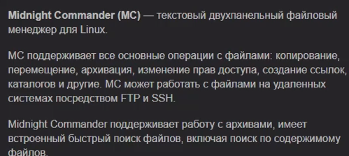{#fig:001 width=70%}

2. Устнавливаю (рис. @fig:002) и запускаю mc (рис. @fig:003):

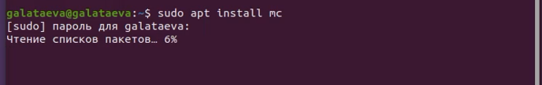{#fig:002 width=70%}

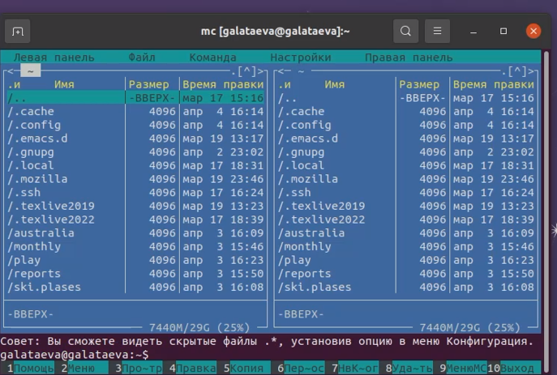{#fig:003 width=70%}

3. Выполнила несколько операций в mс: 
   - операции с панелями,
   - выделение/отмена выделения файлов, 
   - копирование/перемещение файлов, 
   - получение информации о размере и правах доступа на файлы и/или каталоги,
   - выполнила основные команды меню левой (или правой) панели.

4. Выполнила:
   - просмотр содержимого текстового файла (рис. @fig:004),
   - редактирование содержимого текстового файла (без сохранения результатов редактирования) (рис. @fig:005),
   - создание каталога (рис. @fig:006),
   - копирование в файлов в созданный каталог (рис. @fig:007).
   
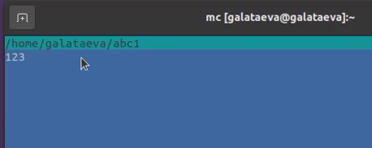{#fig:004 width=70%}

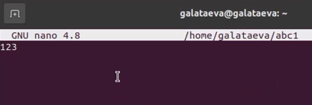{#fig:005 width=70%}

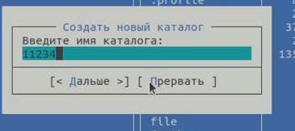{#fig:006 width=70%}

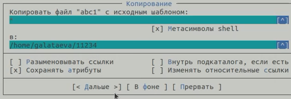{#fig:007 width=70%} 

5. С помощью соответствующих средств подменю Команда осуществила:
   - поиск в файловой системе файла с заданными условиями (например, файла с расширением .c или .cpp, содержащего строку main) (рис. @fig:008),
   - выбор и повторение одной из предыдущих команд;
   - переход в домашний каталог (рис. @fig:009),
   - анализ файла меню (рис. @fig:010) и файла расширений (рис. @fig:011).

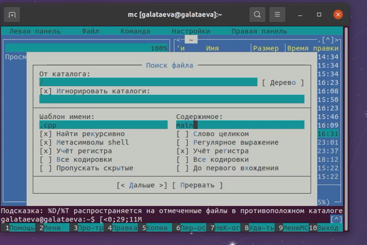{#fig:008 width=70%}

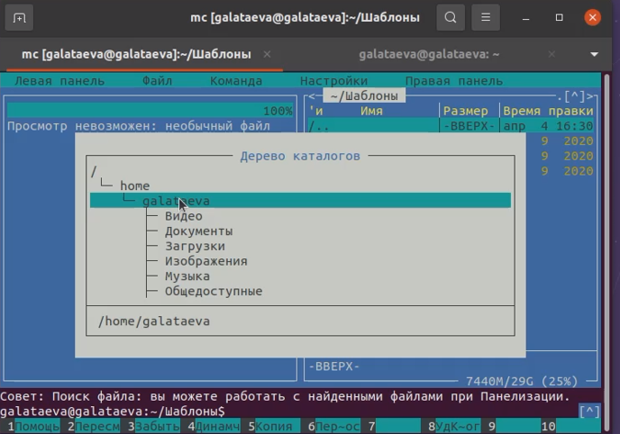{#fig:009 width=70%}

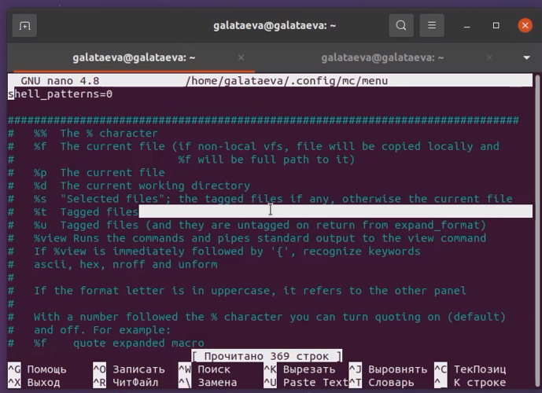{#fig:010 width=70%}

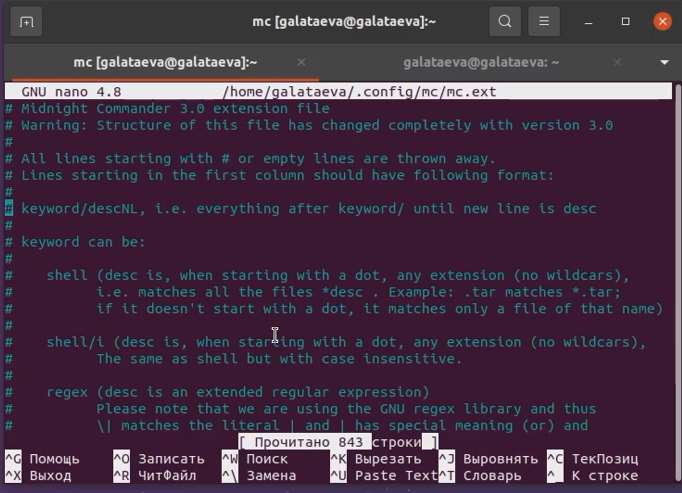{#fig:011 width=70%}

6. Вызовала подменю Настройки и освоила операции, определяющие структуру экрана mc.

**Задание по встроенному редактору mc**

1. Создала текстовой файл text.txt, открыла его с помощью встроенного в mc редактора и вставила в небольшой фрагмент текста, скопированный из Интернета (рис. @fig:012):

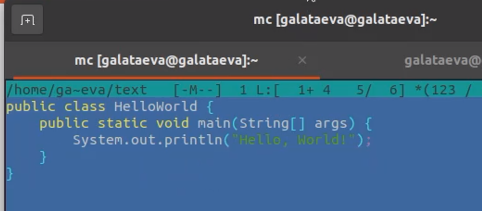{#fig:012 width=70%}

2. Проделала с текстом следующие манипуляции:
   1. Удалить строку текста (рис. @fig:013),
   2. Выделить фрагмент текста и скопируйте его на новую строку (рис. @fig:014),
   3. Выделить фрагмент текста и перенесите его на новую строку,
   4. Сохранить файл,
   5. Отменить последнее действие,
   6. Перейдти в конец файла (нажав комбинацию клавиш) и написать некоторый текст (рис. @fig:015),
   7. Перейти в начало файла (нажав комбинацию клавиш) и написать некоторый текст (рис. @fig:016),
   8. Сохранить и закрыть файл.
   
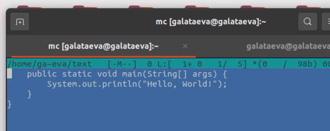{#fig:013 width=70%}

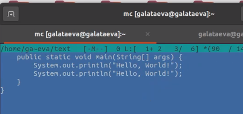{#fig:014 width=70%}

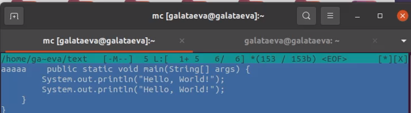{#fig:015 width=70%}

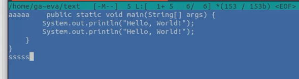{#fig:016 width=70%} 

3. Используя меню редактора, выключила подсветку синтаксиса (рис. @fig:017):

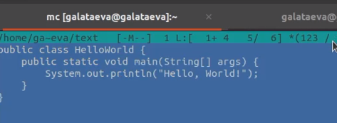{#fig:017 width=70%}

# Выводы

Я освоила основные возможности командной оболочки Midnight Commander и приобрела навыки практической работы по просмотру каталогов и файлов, манипуляций с ними.

# Контрольные вопросы

1. Какие режимы работы есть в mc. Охарактеризуйте их.

Режим просмотра файлов. Существует четыре таких режима: Full, Brief, Long и User. 

   - В режиме Full отображается имя файла, размер файла и время последней модификации.
   - В режиме Brief список файлов располагается в две колонки и состоит только из имён файлов (поэтому в этом режиме отображается наибольшее количество файлов, по сравнению с другими режимами). 
   - Режим Long идентичен результату выполнения команды ls -l. В этом режиме панель занимает весь экран.

2. Какие операции с файлами можно выполнить как с помощью команд shell, так и с помощью меню (комбинаций клавиш) mc? Приведите несколько примеров.

Создать файл, удалить файл, переименовать файл, копировать файл, редактировать файл, прочитать содержимое файла.

3. Опишите структура меню левой (или правой) панели mc, дайте характеристику
командам.

   - Список файлов, показывает список файлов.
   - Быстрый просмотр, показывает содержимое файла.
   - Информация – на панель выводятся сведения о файле и текущей файловой системе, расположенных на активной панели.
   - Дерево – выводиться структура дерева каталогов
   - Формат списка – редактировать отображение списка
   - Порядок сортировки – сортирует список
   - Фильтр – фильтрует файлы по заданному имени

4. Опишите структура меню Файл mc, дайте характеристику командам.

   - Просмотр – просмотр текущего файла
   - Просмотр вывода команды – функция запроса команды с параметрами
   - Правка – открывает текущий файл для его редактирования
   - Копирование – копирует файлы или каталоги в указанное место
   - Права доступа – позволяет изменить права доступа к одному или нескольким файлам/каталогам
   - Жесткая ссылка – позволяет создать жёсткую ссылку к текущему файлу
   - Символическая ссылка – позволяет создать символическую ссылку к файлу.
   - Владелец/группа – позволяет задать владельца и имя группы для одного или нескольких файлов/каталогов
   - Права (Расширенные) – позволяет изменить права доступа и владения для одного или нескольких файлов или каталогов
   - Переименование – переименовывает файл/каталог
   - Создание каталога – создает каталог
   - Удалить – удаляет файл/каталог
   - Выход – завершает работу MC

5. Опишите структура меню Команда mc, дайте характеристику командам.

   - Дерево каталогов — отображает структуру каталогов системы.
   - Поиск файла — выполняет поиск файлов по заданным параметрам.
   - Переставить панели — меняет местами левую и правую панели.
   - Сравнить каталоги ( Ctrl-x d ) — сравнивает содержимое двух каталогов.
   - Размеры каталогов — отображает размер и время изменения каталога (по умолчанию в mc размер каталога корректно не отображается).
   - История командной строки — выводит на экран список ранее выполненных в оболочке команд.
   - Каталоги быстрого доступа ( Ctrl-\ ) — пр вызове выполняется быстрая смена текущего каталога на один из заданного списка.
   - Восстановление файлов — позволяет восстановить файлы на файловых системах ext2 и ext3.
   - Редактировать файл расширений — позволяет задать с помощью определённого синтаксиса действия при запуске файлов с определённым расширением (например, какое программного обеспечение запускать для открытия или редактирования файлов с расширением doc или docx).
   - Редактировать файл меню — позволяет отредактировать контекстное меню пользователя, вызываемое по клавише F2.
   - Редактировать файл расцветки имён — позволяет подобрать оптимальную для пользователя расцветку имён файлов в зависимости от их типа.

6. Опишите структура меню Настройки mc, дайте характеристику командам.

   - Конфигурация — позволяет скорректировать настройки работы с панелями.
   - Внешний вид и Настройки панелей — определяет элементы (строка меню, командная строка, подсказки и прочее), отображаемые при вызове mc, а также геометрию расположения панелей и цветовыделение.
   - Биты символов — задаёт формат обработки информации локальным терминалом.
   - Подтверждение — позволяет установить или убрать вывод окна с запросом подтверждения действий при операциях удаления и перезаписи файлов, а также при выходе из программы.
   - Распознание клавиш — диалоговое окно используется для тестирования функциональных клавиш, клавиш управления курсором и прочее.
   - Виртуальные ФС — настройки виртуальной файловой системы: тайм-аут, пароль и прочее.

7. Назовите и дайте характеристику встроенным командам mc.

   - name отображать имя файла
   - size отображать размер файла
   - bsize отображать размер в альтернативной форме, при которой выводятся размеры файлов, а для каталогов выводится только надпись "ПОД-КАТ" ("SUB-DIR") или "ВВЕРХ" ("UP--DIR")
   - type отображать односимвольное поле типа. Этот символ может принимать значения из подмножества символов, выводимых командой ls -F: * (asterisk) для исполняемых файлов, / (slash) для каталогов, @ (at-sign) для ссылок (links), = (знак равенства) для сокетов (sockets), - дефис (hyphen) для байт-ориентированных устройств, + для блок-ориентированных устройств, | (pipe) для файлов типа FIFO, (тильда) для символических ссылок на каталоги, ! (восклицательный знак) для оборванных (stale) символических ссылок (ссылок, указывающих в никуда)
   - mark Звездочка (asterisk) если файл помечен, пробел - если не помечен
   - mtime время последней модификации файла
   - atime время последнего доступа к файлу
   - ctime время последнего изменения файла
   - perm строка, показывающая текущие права доступа к файлу
   - mode восьмеричное представление текущих прав доступа к файлу
   - nlink число ссылок на данный файл
   - ngid идентификатор группы (GID, в цифровой форме)
   - nuid идентификатор пользователя (UID, в цифровой форме).
   - owner владелец файла
   - group группа, имеющая права на файл
   - inode номер inode файла

8. Назовите и дайте характеристику командам встроенного редактора mc.

   - Ctrl-y удалить строку
   - Ctrl-u отмена последней операции
   - Ins вставка/замена
   - F7 поиск (можно использовать регулярные выражения)
   - Shift-F7 повтор последней операции поиска
   - F4 замена
   - F3 первое нажатие — начало выделения, второе — окончание выделения
   - F5 копировать выделенный фрагмент
   - F6 переместить выделенный фрагмент
   - F8 удалить выделенный фрагмент
   - F2 записать изменения в файл
   - F10 выйти из редактора

9. Дайте характеристику средствам mc, которые позволяют создавать меню, определяемые пользователем.
Строка главного меню появляется в верхней части экрана после нажатия клавиши F9 или щелчка мыши по верхней рамке экрана. Меню состоит из пяти пунктов: "Левая", "Файл", Команды", Настройки" и "Правая" (в английской версии соответственно "Left", "File", "Command", "Options" и "Right"). При выборе одного из этих пунктов появляется соответствующее выпадающее меню. 
   - Пункты меню "Левая" и "Правая " ("Верхняя" и "Нижняя") позволяют изменить вид, соответственно, левой и правой (или верней и нижней) панелей и характер отображаемой в панели информации, в частности, выполнить соединения с удаленными компьютерами.
   - Меню "Файл" позволяет выполнить какие-то действия с выбранным файлом или группой помеченных файлов.
   - Меню "Команды" перечисляет действия, которые имеют более общий характер и не относятся только к выделенному в данный момент файлу или группе помеченных файлов.
   - Меню "Настройки" служит для задания ряда параметров, определяющих внешний вид и поведение программы Midnight Commander. Один из пунктов этого меню служит для сохранения настроек, заданных пользователем.

10. Дайте характеристику средствам mc, которые позволяют выполнять действия, определяемые пользователем, над текущим файлом.

   - C-l Обновляет всю информацию, отображаемую программой Midnight Commander.
   - C-x c Запускает команду Chmod для подсвеченного файла или группы отмеченных файлов.
   - C-x o Запускает команду Chown для подсвеченного файла или группы отмеченных файлов.
   - C-x l Запускает команду создания жесткой ссылки.
   - C-x s Запускает команду создания абсолютной символической ссылки.
   - C-x v Запускает команду создания относительной символической ссылки. Для более детальной информации о ссылках смотрите раздел Меню Файл
   - C-x i Переводит пассивную панель в режим "Информация".
   - C-x q Переводит пассивную панель в режим быстрого просмотра.
   - C-x ! Выполняется пункт меню "Критерий панелизации".
   - C-x h Добавить имя каталога в "Каталоги быстрого доступа".
   - M-! Выполняет пункт меню "Просмотр вывода команды", который описан подробнее в разделе "Меню "Файл".
   - M-? Вызов диалогового окна "Поиск файла".
   - M-c Вызов диалогового окна "Быстрая смена каталога".
   - C-o Если Midnight Commander запущен в консоли Linux или FreeBSD, или через xterm, вам будет показан вывод предыдущей команды. При этом на Linux-консоли Midnight Commander использует встроенную программу (cons.saver) для сохранения выводимой информации и демонстрации ее на экране.

# Список литературы

1. https://ru.wikipedia.org/wiki/Midnight_Commander
2. https://ya.ru
