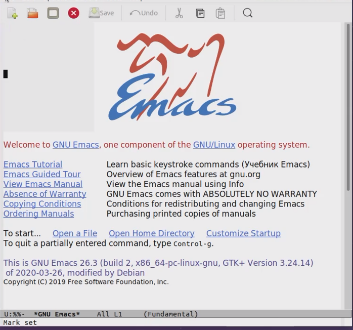
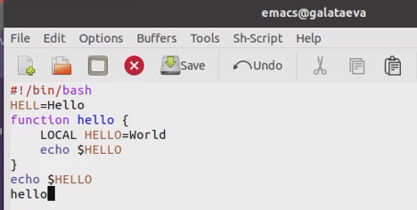
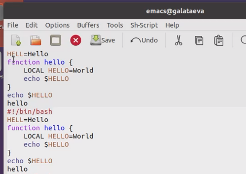
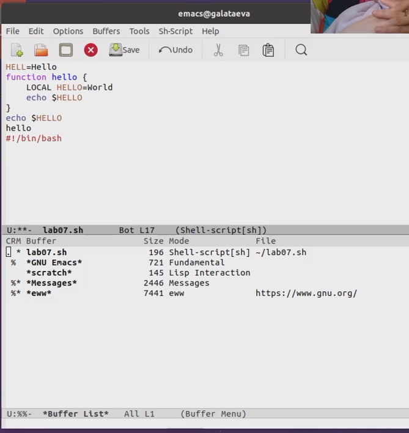
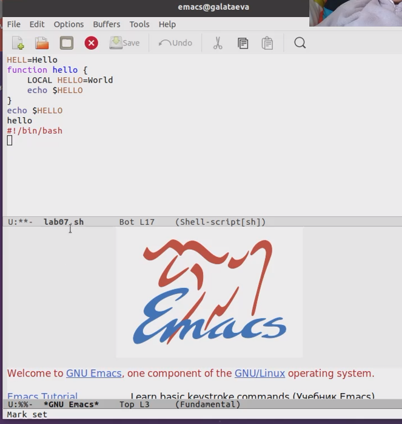
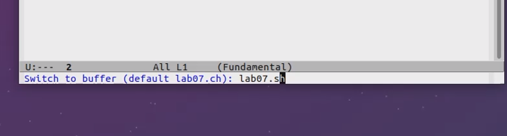
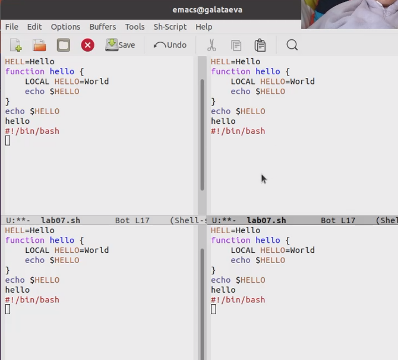
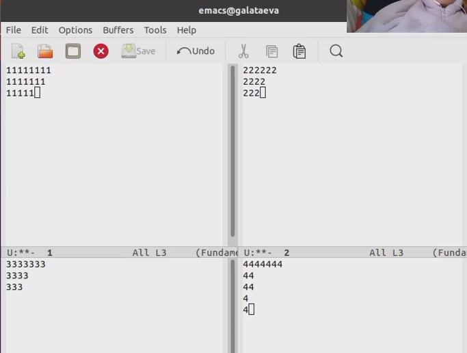

---
## Front matter
title: "Отчёт по лабораторной работе №10"
subtitle: "дисциплина: Операционные системы"
author: "Латаева Гюзелия Андреевна"

## Generic otions
lang: ru-RU
toc-title: "Содержание"

## Bibliography
bibliography: bib/cite.bib
csl: pandoc/csl/gost-r-7-0-5-2008-numeric.csl

## Pdf output format
toc: true # Table of contents
toc-depth: 2
lof: true # List of figures
lot: true # List of tables
fontsize: 12pt
linestretch: 1.5
papersize: a4
documentclass: scrreprt
## I18n polyglossia
polyglossia-lang:
  name: russian
  options:
	- spelling=modern
	- babelshorthands=true
polyglossia-otherlangs:
  name: english
## I18n babel
babel-lang: russian
babel-otherlangs: english
## Fonts
mainfont: PT Serif
romanfont: PT Serif
sansfont: PT Sans
monofont: PT Mono
mainfontoptions: Ligatures=TeX
romanfontoptions: Ligatures=TeX
sansfontoptions: Ligatures=TeX,Scale=MatchLowercase
monofontoptions: Scale=MatchLowercase,Scale=0.9
## Biblatex
biblatex: true
biblio-style: "gost-numeric"
biblatexoptions:
  - parentracker=true
  - backend=biber
  - hyperref=auto
  - language=auto
  - autolang=other*
  - citestyle=gost-numeric
## Pandoc-crossref LaTeX customization
figureTitle: "Рис."
tableTitle: "Таблица"
listingTitle: "Листинг"
lofTitle: "Список иллюстраций"
lotTitle: "Список таблиц"
lolTitle: "Листинги"
## Misc options
indent: true
header-includes:
  - \usepackage{indentfirst}
  - \usepackage{float} # keep figures where there are in the text
  - \floatplacement{figure}{H} # keep figures where there are in the text
---

# Цель работы

Познакомиться с операционной системой Linux. Получить практические навыки работы с редактором Emacs.

# Задание

1. Ознакомиться с теоретическим материалом.
2. Ознакомиться с редактором emacs.
3. Выполнить упражнения.
4. Ответить на контрольные вопросы.

# Теоретическое введение

Определение. Буфер — объект, представляющий какой-либо текст.

Буфер может содержать что угодно, например, результаты компиляции программы или встроенные подсказки. Практически всё взаимодействие с пользователем, в том числе интерактивное, происходит посредством буферов.

Определение. Фрейм соответствует окну в обычном понимании этого слова. Каждый фрейм содержит область вывода и одно или несколько окон Emacs.

Определение. Окно — прямоугольная область фрейма, отображающая один из буферов.

Каждое окно имеет свою строку состояния, в которой выводится следующая информация: название буфера, его основной режим, изменялся ли текст буфера и как далеко вниз по буферу расположен курсор. Каждый буфер находится только в одном из возможных основных режимов. Существующие основные режимы включают режим Fundamental (наименее специализированный), режим Text, режим Lisp, режим С, режим Texinfo и другие. Под второстепенными режимами понимается список режимов, которые включены в данный момент в буфере выбранного
окна.

Определение. Область вывода — одна или несколько строк внизу фрейма, в которой Emacs выводит различные сообщения, а также запрашивает подтверждения и дополнительную информацию от пользователя.

Определение. Минибуфер используется для ввода дополнительной информации и всегда отображается в области вывода.

Определение. Точка вставки — место вставки (удаления) данных в буфере.

Для запуска Emacs необходимо в командной строке набрать emacs (или emacs & для работы в фоновом режиме относительно консоли).

Для работы с Emacs можно использовать как элементы меню, так и различные сочетания клавиш. 

# Выполнение лабораторной работы

1. Я ознакомилась с теоретическим материалом и с редактором emacs.
2. Упражнения:

   1. Открыть emacs (рис. @fig:001):

{#fig:001 width=70%}

   2. Создать файл lab07.sh, набрать текст и сохранить файл (рис. @fig:002):

{#fig:002 width=70%}
   
   3. Проделать с текстом стандартные процедуры редактирования:

      - Я вырезала одной командой целую строку (С-k)

      - Вставила эту строку в конец файла (C-y)

      - Выделила область текста (C-space)

      - Скопировала область в буфер обмена (M-w)

      - Вставила область в конец файла

      - Вновь выделила эту область и на этот раз вырезала её (C-w)

      - Отменила последнее действие (C-/)
      
   Я получила такой результат (рис. @fig:003):

{#fig:003 width=70%}

   4. Нучиться использовать команды по перемещению курсора.

      - Я переместитла курсор в начало строки комбанацией (C-a)

      - Я переместитла курсор в конец строки комбанацией (C-e)

      - Я переместитла курсор в начало буфера комбанацией (M-<)

      - Я переместитла курсор в конец буфера комбанацией (M->)

   5. Управление буферами.
   
      - Вывела список активных буферов на экран (C-x C-b) (рис. @fig:004):

{#fig:004 width=70%}

      - Переместилась во вновь открытое окно (C-x) o 
      со списком открытых буферов и переключилась на другой буфер (рис. @fig:005):

{#fig:005 width=70%}

      - Закрыла это окно (C-x 0).

      - Переключалась между буферами, но уже без вывода их списка на экран (C-x b) (рис. @fig:006):

{#fig:006 width=70%}

   6. Управление окнами.
   
      - Поделила фрейм на 4 части (рис. @fig:007):

{#fig:007 width=70%}
      
      - В каждом из четырёх созданных окон открыла новый буфер (файл) и 
      ввела несколько строк текста (рис. @fig:008):

{#fig:008 width=70%}

   7. Режим поиска
   
      - Переключилась в режим поиска (C-s).

      - Переключалась между результатами поиска, нажимая C-s.
   
      - Вышла из режима поиска, нажав C-g.

      - Перешла в режим поиска и замены (M-%).
      
      - Попробовала другой режим поиска, нажав M-s o. Данный вид поиска отличается от обычного тем, что тут считывается строка поиска, которая трактуется как регулярное выражение, и не осуществляется поиск точного совпадения в тексте буфера.

# Выводы

Я познакомилась с операционной системой Linux. Получила практические навыки работы с редактором Emacs.

# Контрольные вопросы
1. Кратко охарактеризуйте редактор emacs.

Emacs − один из наиболее мощных и широко распространённых редакторов, используемых в мире Unix. По популярности он соперничает с редактором vi и его клонами.

2. Какие особенности данного редактора могут сделать его сложным для освоения
новичком?

Основную трудность для новичков при освоении данного редактора могут составлять большое количество команд, комбинаций клавиш, которые не получится все запомнить с первого раза и поэтоу придется часто обращаться к справочным материалам

3. Своими словами опишите, что такое буфер и окно в терминологии emacs’а.

Буфер – представляет собой текст. Если имеется несколько буферов, то редактировать можно только один. Обычно буфер считывает данные из файла или записывает в файл данные из буфера. 

Окно – это область экрана, отображающая буфер. При запуске редактора отображается одно окно, но при обращении к некоторым функциям могут открыться дополнительные окна. 

4. Можно ли открыть больше 10 буферов в одном окне?

Да.

5. Какие буферы создаются по умолчанию при запуске emacs?

Следующие буферы:

- «scratch» (буфер для несохраненного текста)
- «Messages» (журнал ошибок, включающий также информацию, которая появляется в области EchoArea)
- «GNU Emacs» (справочный буфер о редакторе)

6. Какие клавиши вы нажмёте, чтобы ввести следующую комбинацию C-c | и C-c C-|?

C-c | сначала, удерживая «ctrl», нажимаю «c», после – отпускаю обе клавиши и нажимаю «|» 

C-c C-| сначала, удерживая «ctrl», нажимаю «с», после – отпускаю обе клавиши и, удерживая «ctrl», нажимаю «|»

7. Как поделить текущее окно на две части?

Воспользоваться комбинацией «Ctrl-x 3» (по вертикали) или «Ctrl-x 2» (по горизонтали).
 
8. В каком файле хранятся настройки редактора emacs?

В файле .emacs.

9. Какую функцию выполняет клавиша «←» и можно ли её переназначить?

Удаляет символ перед курсором, её можно переназначить. Для этого необхдимо изменить конфигурацию файла .emacs.

10. Какой редактор вам показался удобнее в работе vi или emacs? Поясните почему.

Emacs, потому что в нем проще открывать другие файлы, можно использовать сразу несколько окон, нет «Командного режима», «Режима ввода», «Режима командной строки», которые являются неудобными.

# Список литературы

1. https://ya.ru/
