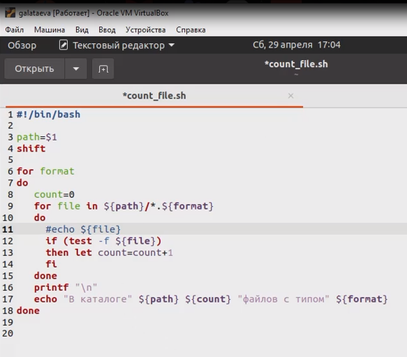

---
## Front matter
title: "Отчёт по лабораторной работе №11"
subtitle: "дисциплина: Операционные системы"
author: "Латаева Гюзелия Андреевна"

## Generic otions
lang: ru-RU
toc-title: "Содержание"

## Bibliography
bibliography: bib/cite.bib
csl: pandoc/csl/gost-r-7-0-5-2008-numeric.csl

## Pdf output format
toc: true # Table of contents
toc-depth: 2
lof: true # List of figures
lot: true # List of tables
fontsize: 12pt
linestretch: 1.5
papersize: a4
documentclass: scrreprt
## I18n polyglossia
polyglossia-lang:
  name: russian
  options:
	- spelling=modern
	- babelshorthands=true
polyglossia-otherlangs:
  name: english
## I18n babel
babel-lang: russian
babel-otherlangs: english
## Fonts
mainfont: PT Serif
romanfont: PT Serif
sansfont: PT Sans
monofont: PT Mono
mainfontoptions: Ligatures=TeX
romanfontoptions: Ligatures=TeX
sansfontoptions: Ligatures=TeX,Scale=MatchLowercase
monofontoptions: Scale=MatchLowercase,Scale=0.9
## Biblatex
biblatex: true
biblio-style: "gost-numeric"
biblatexoptions:
  - parentracker=true
  - backend=biber
  - hyperref=auto
  - language=auto
  - autolang=other*
  - citestyle=gost-numeric
## Pandoc-crossref LaTeX customization
figureTitle: "Рис."
tableTitle: "Таблица"
listingTitle: "Листинг"
lofTitle: "Список иллюстраций"
lotTitle: "Список таблиц"
lolTitle: "Листинги"
## Misc options
indent: true
header-includes:
  - \usepackage{indentfirst}
  - \usepackage{float} # keep figures where there are in the text
  - \floatplacement{figure}{H} # keep figures where there are in the text
---

# Цель работы

Изучить основы программирования в оболочке ОС UNIX/Linux. Научиться писать небольшие командные файлы.

# Задание

1. Написать скрипт, который при запуске будет делать резервную копию самого себя (то есть файла, в котором содержится его исходный код) в другую директорию backup в вашем домашнем каталоге. При этом файл должен архивироваться одним из архиваторов на выбор zip, bzip2 или tar. Способ использования команд архивации необходимо узнать, изучив справку.

2. Написать пример командного файла, обрабатывающего любое произвольное число аргументов командной строки, в том числе превышающее десять. Например, скрипт может последовательно распечатывать значения всех переданных аргументов.

3. Написать командный файл — аналог команды ls (без использования самой этой команды и команды dir). Требуется, чтобы он выдавал информацию о нужном каталоге и выводил информацию о возможностях доступа к файлам этого каталога.

4. Написать командный файл, который получает в качестве аргумента командной строки формат файла (.txt, .doc, .jpg, .pdf и т.д.) и вычисляет количество таких файлов в указанной директории. Путь к директории также передаётся в виде аргумента командной строки.

# Теоретическое введение

Командный процессор (командная оболочка, интерпретатор команд shell) — это программа, позволяющая пользователю взаимодействовать с операционной системой компьютера. В операционных системах типа UNIX/Linux наиболее часто используются следующие реализации командных оболочек:

- оболочка Борна (Bourne shell или sh) — стандартная командная оболочка UNIX/Linux, содержащая базовый, но при этом полный набор функций;

- С-оболочка (или csh) — надстройка на оболочкой Борна, использующая Сподобный синтаксис команд с возможностью сохранения истории выполнения команд;

- оболочка Корна (или ksh) — напоминает оболочку С, но операторы управления программой совместимы с операторами оболочки Борна;

- BASH — сокращение от Bourne Again Shell (опять оболочка Борна), в основе своей совмещает свойства оболочек С и Корна (разработка компании Free Software Foundation).

POSIX (Portable Operating System Interface for Computer Environments) — набор стандартов описания интерфейсов взаимодействия операционной системы и прикладных программ.

Стандарты POSIX разработаны комитетом IEEE (Institute of Electrical and Electronics Engineers) для обеспечения совместимости различных UNIX/Linuxподобных операционных систем и переносимости прикладных программ на уровне исходного кода. POSIX-совместимые оболочки разработаны на базе оболочки Корна.

Последовательность команд может быть помещена в текстовый файл. Такой файл называется командным. Далее этот файл можно выполнить по команде:

**bash командный_файл [аргументы]**

Чтобы не вводить каждый раз последовательности символов bash, необходимо изменить код защиты этого командного файла, обеспечив доступ к этому файлу по выполнению. Это может быть сделано с помощью команды:

**chmod +x имя_файла**

# Выполнение лабораторной работы

**Задание 1.**

1. Создала файл backup.sh и устанавливаю ему права на выполнение.

2. Написала скрипт, который при запуске делает резервную копию самого себя в другую директорию backup в домашнем каталоге в архив с именем backup.sh формата .bz2: (рис. @fig:001)

{#fig:001 width=70%}

3. Выполнила скрипт: (рис. @fig:002)

{#fig:002 width=70%}

4. Результат: (рис. @fig:003)

{#fig:003 width=70%}

**Задание 2.**

1. Создала файл print_arg.sh и устанавливаю ему права на выполнение.

2. Написала командный файл, который последовательно циклом выводит на печать введенные пользователем аргументы (больше 10 тоже выводит): (рис. @fig:004)

{#fig:004 width=70%}

3. Выполнила скрипт и получила результат: (рис. @fig:005)

{#fig:005 width=70%}

**Задание 3.**

1. Создала файл ls_analog.sh и устанавливаю ему права на выполнение. 

2. Написала командный файл который проходится циклом по всем файлам и каталогам и вы водит информацию о возможностях доступа к файлам/каталогам этого каталога: (рис. @fig:006)

{#fig:006 width=70%}

3. Выполнила скрипт и получила результат: (рис. @fig:007), (рис. @fig:008):

{#fig:007 width=70%}

{#fig:008 width=70%}

**Задание 4.**

1. Создала файл count_file.sh и устанавливаю ему права на выполнение.

2. Написала командный файл, принимающий в качестве аргументов путь к директории и форматы файлов и выводящий количество файлов с указанными форматами в указанной директории (рис. @fig:009):

{#fig:009 width=70%}

3. Выполнила скрипт и получила результат: (рис. @fig:010):

{#fig:010 width=70%}

# Выводы

 Я изучила основы программирования в оболочке ОС UNIX/Linux. Научилась писать небольшие командные файлы.

# Контрольные вопросы

1. Объясните понятие командной оболочки. Приведите примеры командных оболочек. Чем они отличаются?

Командный процессор (командная оболочка, интерпретатор команд shell) − это программа, позволяющая пользователю взаимодействовать с операционной системой компьютера. В операционных системах типа UNIX/Linux наиболее часто используются следующие реализации командных оболочек:

- оболочка Борна (Bourne shell или sh) − стандартная командная оболочка UNIX/Linux, содержащая базовый, но при этом полный набор функций;

- С-оболочка (или csh) − надстройка на оболочкой Борна, использующая Сподобный синтаксис команд с возможностью сохранения истории выполнения команд;

- оболочка Корна (или ksh) − напоминает оболочку С, но операторы управления программой совместимы с операторами оболочки Борна;

- BASH − сокращение от Bourne Again Shell (опять оболочка Борна), в основе своей совмещает свойства оболочек С и Корна (разработка компании Free Software Foundation).

2. Что такое POSIX?

POSIX (Portable Operating System Interface for Computer Environments) — набор стандартов описания интерфейсов взаимодействия операционной системы и прикладных программ.

3. Как определяются переменные и массивы в языке программирования bash?

Командный процессор bash обеспечивает возможность использования переменных типа строка символов. Использование значения, присвоенного некоторой переменной, называется подстановкой. Для того чтобы имя переменной не сливалось с символами, которые могут следовать за ним в командной строке, при подстановке в общем случае используется следующая форма записи:

${имя переменной}

Например, использование команд b=/tmp/andyls -l myfile > ${b}lssudo apt-get install texlive-luatex приведёт к переназначению стандартного вывода команды ls с терминала на файл /tmp/andy-ls, а использование команды ls -l>$bls приведёт к подстановке в командную строку значения переменной bls. Если переменной bls не было предварительно присвоено никакого значения, то её значением будет символ пробела.

Оболочка bash позволяет работать с массивами. Для создания массива используется команда set с флагом -A. За флагом следует имя переменной, а затем списокзначений, разделённых пробелами. Например,

set -A states Delaware  Michigan "New Jersey"

Далее можно сделать добавление в массив, например, states[49]=Alaska. 

4. Каково назначение операторов let и read?

Оболочка bash поддерживает встроенные арифметические функции. Команда let является показателем того, что последующие аргументы представляют собой выражение, подлежащее вычислению. Простейшее выражение − это единичный терм (term), обычно целочисленный. Команда let берет два операнда и присваивает их переменной. 

Команда read позволяет читать значения переменных со стандартного ввода: «echo "Please enter Month and Day of Birth ?"» «read mon day trash» В переменные mon и day будут считаны соответствующие значения, введённые с клавиатуры, а переменная trash нужна для того, чтобы отобрать всю избыточно введённую информацию и игнорировать её.

5. Какие арифметические операции можно применять в языке программирования
bash?

В языке программирования bash можно применять такие арифметические операции как сложение (+), вычитание (-), умножение (*), целочисленное деление (/) и целочисленный остаток от деления (%).

6. Что означает операция (( ))?

В (( )) можно записывать условия оболочки bash, а также внутри двойных скобок можно вычислять арифметические выражения и возвращать результат.

7. Какие стандартные имена переменных Вам известны?

PATH, HOME, IFS, MAIL, TERM, LOGNAME.

8. Что такое метасимволы?

Метасимволы в языке программирования bash (и в других Unix-подобных системах) - это специальные символы, которые используются для выполнения определенных действий при работе с файлами и директориями.

9. Как экранировать метасимволы?

Экранирование может быть осуществлено с помощью предшествующего метасимволу символа \, который, в свою очередь, является метасимволом. 

Для экранирования группы метасимволов нужно заключить её в одинарные кавычки. Строка, заключённая в двойные кавычки, экранирует все метасимволы, кроме $, ' , , ".

10. Как создавать и запускать командные файлы?

Последовательность команд может быть помещена в текстовый файл. Такой файл называется командным. Далее этот файл можно выполнить по команде:

bash командный_файл [аргументы]

Чтобы не вводить каждый раз последовательности символов bash, необходимо изменить код защиты этого командного файла, обеспечив доступ к этому файлу по выполнению. Это может быть сделано с помощью команды:

chmod +x имя_файла

Теперь можно вызывать свой командный файл на выполнение, просто вводя его имя с терминала так, как-будто он является выполняемой программой. Командный процессор распознает, что в Вашем файле на самом деле хранится не выполняемая программа, а программа, написанная на языке программирования оболочки, и осуществит её интерпретацию.

11. Как определяются функции в языке программирования bash?

Группу команд можно объединить в функцию. Для этого существует ключевое слово function, после которого следует имя функции и список команд, заключённых в фигурные скобки. Удалить функцию можно с помощью команды unset c флагом -f.

12. Каким образом можно выяснить, является файл каталогом или обычным файлом?

Чтобы выяснить, является ли файл каталогом или обычным файлом, необходимо воспользоваться командами «test -f [путь до файла]» (для проверки, является ли обычным файлом) и «test -d [путь до файла]» (для проверки, является ли каталогом).

13. Каково назначение команд set, typeset и unset?

Команда set используется для установки или изменения различных опций для текущего сеанса оболочки. 

Команда typeset используется для объявления переменных и установки их атрибутов.

Команда unset используется для удаления переменных и функций. 

14. Как передаются параметры в командные файлы?

Параметры передаются в командные файлы через аргументы командной строки. Когда командный файл запускается, любые аргументы, переданные в командную строку после его имени, становятся доступными внутри скрипта через специальные переменные.

15. Назовите специальные переменные языка bash и их назначение.

Специальные переменные:

$* − отображается вся командная строка или параметры оболочки;

$? − код завершения последней выполненной команды;

$$ − уникальный идентификатор процесса, в рамках которого выполняется командный процессор;

$! − номер процесса, в рамках которого выполняется последняя вызванная на выполнение в командном режиме команда;

$- − значение флагов командного процессора;

${#} − возвращает целое число − количество слов, которые были результатом $;

${#name} − возвращает целое значение длины строки в переменной name;

${name[n]} − обращение к n-му элементу массива;

${name[*]} − перечисляет все элементы массива, разделённые пробелом;

${name[@]} − то же самое, но позволяет учитывать символы пробелы в самих переменных;

${name:-value} − если значение переменной name не определено, то оно будет заменено на указанное value;

${name:value} − проверяется факт существования переменной;

${name=value} − если name не определено, то ему присваивается значение value;

${name?value} − останавливает выполнение, если имя переменной не определено, и выводит value как сообщение об ошибке;

${name+value} − это выражение работает противоположно ${name-value}. Если переменная определена, то подставляется value;

${name#pattern} − представляет значение переменной name с удалённым самым коротким левым образцом (pattern);

${#name[*]} и ${#name[@]} − эти выражения возвращают количество элементов в массиве name.

# Список литературы{.unnumbered}

1. https://ya.ru/
