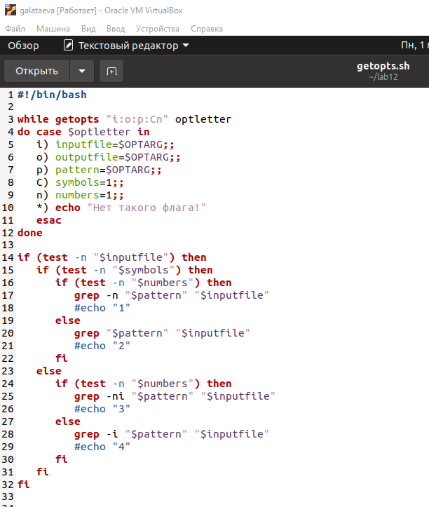
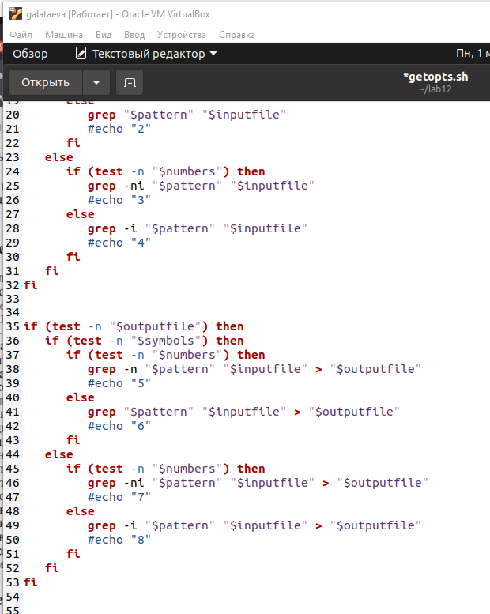
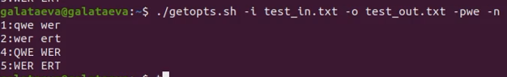
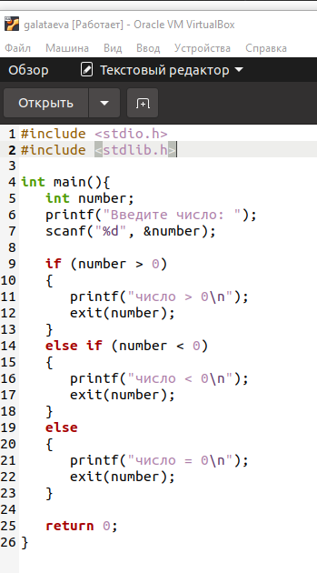
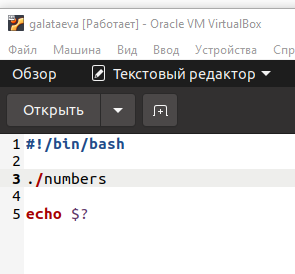
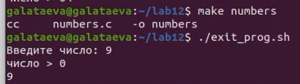
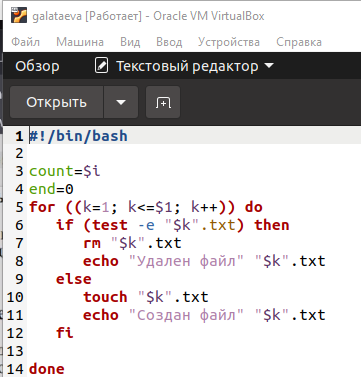
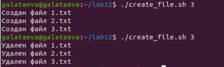
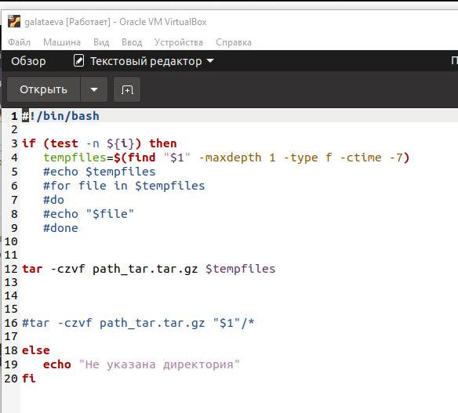
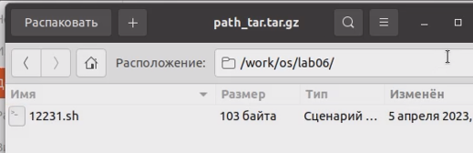

---
## Front matter
title: "Отчёт по лабораторной работе №12"
subtitle: "дисциплина: Операционные системы"
author: "Латаева Гюзелия Андреевна"

## Generic otions
lang: ru-RU
toc-title: "Содержание"

## Bibliography
bibliography: bib/cite.bib
csl: pandoc/csl/gost-r-7-0-5-2008-numeric.csl

## Pdf output format
toc: true # Table of contents
toc-depth: 2
lof: true # List of figures
lot: true # List of tables
fontsize: 12pt
linestretch: 1.5
papersize: a4
documentclass: scrreprt
## I18n polyglossia
polyglossia-lang:
  name: russian
  options:
	- spelling=modern
	- babelshorthands=true
polyglossia-otherlangs:
  name: english
## I18n babel
babel-lang: russian
babel-otherlangs: english
## Fonts
mainfont: PT Serif
romanfont: PT Serif
sansfont: PT Sans
monofont: PT Mono
mainfontoptions: Ligatures=TeX
romanfontoptions: Ligatures=TeX
sansfontoptions: Ligatures=TeX,Scale=MatchLowercase
monofontoptions: Scale=MatchLowercase,Scale=0.9
## Biblatex
biblatex: true
biblio-style: "gost-numeric"
biblatexoptions:
  - parentracker=true
  - backend=biber
  - hyperref=auto
  - language=auto
  - autolang=other*
  - citestyle=gost-numeric
## Pandoc-crossref LaTeX customization
figureTitle: "Рис."
tableTitle: "Таблица"
listingTitle: "Листинг"
lofTitle: "Список иллюстраций"
lotTitle: "Список таблиц"
lolTitle: "Листинги"
## Misc options
indent: true
header-includes:
  - \usepackage{indentfirst}
  - \usepackage{float} # keep figures where there are in the text
  - \floatplacement{figure}{H} # keep figures where there are in the text
---
# Цель работы

Изучить основы программирования в оболочке ОС UNIX. Научится писать более сложные командные файлы с использованием логических управляющих конструкций и циклов.

# Задание

1. Используя команды getopts grep, написать командный файл, который анализирует командную строку с ключами:

- -iinputfile — прочитать данные из указанного файла;

- -ooutputfile — вывести данные в указанный файл;

- -pшаблон — указать шаблон для поиска;

- -C — различать большие и малые буквы;

- -n — выдавать номера строк.

а затем ищет в указанном файле нужные строки, определяемые ключом -p.

2. Написать на языке Си программу, которая вводит число и определяет, является ли оно больше нуля, меньше нуля или равно нулю. Затем программа завершается с помощью функции exit(n), передавая информацию в о коде завершения в оболочку. Командный файл должен вызывать эту программу и, проанализировав с помощью команды $?, выдать сообщение о том, какое число было введено.

3. Написать командный файл, создающий указанное число файлов, пронумерованных последовательно от 1 до N (например 1.tmp, 2.tmp, 3.tmp,4.tmp и т.д.). Число файлов, которые необходимо создать, передаётся в аргументы командной строки. Этот же командный файл должен уметь удалять все созданные им файлы (если они существуют).

4. Написать командный файл, который с помощью команды tar запаковывает в архив все файлы в указанной директории. Модифицировать его так, чтобы запаковывались только те файлы, которые были изменены менее недели тому назад (использовать команду find)

# Выполнение лабораторной работы

**Задание 1.**

1. Создала файл getopts.sh и устанавливаю ему права на выполнение.

2. Написала командный файл, который анализирует командную строку с ключами:

- -iinputfile — прочитать данные из указанного файла;

- -ooutputfile — вывести данные в указанный файл;

- -pшаблон — указать шаблон для поиска;

- -C — различать большие и малые буквы;

- -n — выдавать номера строк.

а затем ищет в указанном файле нужные строки, определяемые ключом -p.: (рис. @fig:001), (рис. @fig:002)

{#fig:001 width=70%}

{#fig:002 width=70%}

3. Результат после выполнения: (рис. @fig:003)

{#fig:003 width=70%}

**Задание 2.**

1. Создала файл exit_prog.sh и устанавливаю ему права на выполнение.

2.  Написала на языке Си программу, которая вводит число и определяет, является ли оно больше нуля, меньше нуля или равно нулю. Затем программа завершается с помощью функции exit(n), передавая информацию в о коде завершения в оболочку. (рис. @fig:004). Командный файл должен вызывать эту программу и, проанализировав с помощью команды $?, выдать сообщение о том, какое число было введено (рис. @fig:005):

{#fig:004 width=70%}

{#fig:005 width=70%}

3. Выполнила скрипт и получила результат: (рис. @fig:006)

{#fig:006 width=70%}

**Задание 3.**

1. Создала файл create_file.sh и устанавливаю ему права на выполнение. 

2. Написала командный файл, создающий указанное число файлов, пронумерованных последовательно от 1 до N (например 1.tmp, 2.tmp, 3.tmp,4.tmp и т.д.). Число файлов, которые необходимо создать, передаётся в аргументы командной строки. Этот же командный файл должен уметь удалять все созданные им файлы (если они существуют).: (рис. @fig:007)

{#fig:007 width=70%}

3. Выполнила скрипт и получила результат: (рис. @fig:008):

{#fig:008 width=70%}

**Задание 4.**

1. Создала файл tar.sh и устанавливаю ему права на выполнение.

2. Написала командный файл, который с помощью команды tar запаковывает в архив все файлы в указанной директории и модифицировала его так, чтобы запаковывались только те файлы, которые были изменены менее недели тому назад (рис. @fig:009):

{#fig:009 width=70%}

3. Выполнила скрипт и получила результат: (рис. @fig:010):

{#fig:010 width=70%}

4. Результат: (рис. @fig:011):

{#fig:011 width=70%}

# Выводы

Я изучила основы программирования в оболочке ОС UNIX и научилась писать более сложные командные файлы с использованием логических управляющих конструкций и циклов.

# Контрольные вопросы

1. Каково предназначение команды getopts?

Команда getopts в скриптах оболочки Unix/Linux предназначена для обработки опций командной строки. Она позволяет скрипту получать аргументы командной строки в определенном формате, что делает его более удобным для использования конечными пользователями. Команда getopts используется в цикле while, который обрабатывает каждый аргумент командной строки по очереди. Кроме того, getopts позволяет обрабатывать несколько опций в одном аргументе командной строки, а также определить опцию по умолчанию, которая будет использоваться, если пользователь не указал никаких опций.

2. Какое отношение метасимволы имеют к генерации имён файлов?

Метасимволы в UNIX-подобных операционных системах используются для генерации имен файлов и путей к ним. Например, символ звездочки (*) соответствует любой последовательности символов в имени файла, а символ вопросительного знака (?) соответствует одному любому символу. Также метасимволы используются для выполнения поиска и замены текста в файле при использовании утилит, таких как sed и awk.

3. Какие операторы управления действиями вы знаете?

В языке программирования bash есть много операторов управления действиями, вот некоторые из них:

if-then-else: оператор условия, позволяет выполнять определенные действия в зависимости от условия.

for: оператор цикла, позволяет выполнить набор инструкций несколько раз, итерируясь по списку значений.

while: оператор цикла, позволяет выполнять набор инструкций, пока определенное условие остается истинным.

case: оператор выбора, позволяет выбрать действие, которое должно быть выполнено, исходя из значения переменной.

until: оператор цикла, выполняет набор инструкций до тех пор, пока определенное условие не станет истинным.

select: оператор выбора, позволяет создать меню выбора для пользователя.

break: оператор, который прерывает выполнение цикла или выбора.

continue: оператор, который пропускает текущую итерацию цикла или выбора и переходит к следующей.

trap: оператор, который позволяет устанавливать обработчики сигналов и выполнять определенные действия при получении сигнала.

shift: оператор, который позволяет сдвигать значения параметров командной строки на одну позицию.

Это только некоторые из операторов управления действиями в языке bash.

4. Какие операторы используются для прерывания цикла?

break: используется для немедленного выхода из цикла. continue: используется для пропуска текущей итерации цикла и перехода к следующей.

5. Для чего нужны команды false и true?

Команды false и true являются базовыми утилитами в UNIX-подобных операционных системах, которые возвращают код возврата 1 и 0 соответственно. Обычно эти команды используются в комбинации с другими командами и операторами для контроля над процессами, запускаемыми в скриптах.

6. Что означает строка if test -f man$s/$i.s, встреченная в командном файле?

Данная строка используется для проверки наличия файла в определенном месте в файловой системе. Она проверяет, существует ли файл с именем man$s/$i.$s, где $s, $i - переменные, заданные ранее в скрипте.

7. Объясните различия между конструкциями while и until.

Конструкция while используется для выполнения цикла, пока условие истинно. Цикл выполняется, пока результат выражения внутри скобок while истинен.

Конструкция until похожа на while, но выполняет цикл, пока условие ложно. Цикл будет выполняться, пока результат выражения внутри скобок until ложен.

# Список литературы{.unnumbered}

::: {#refs}
:::
