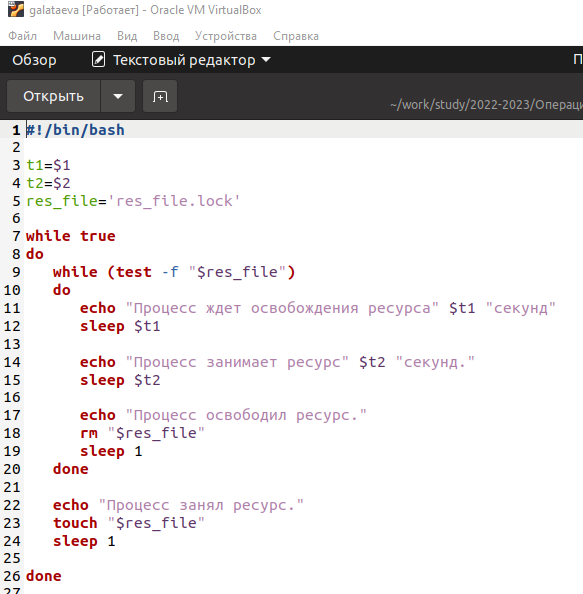
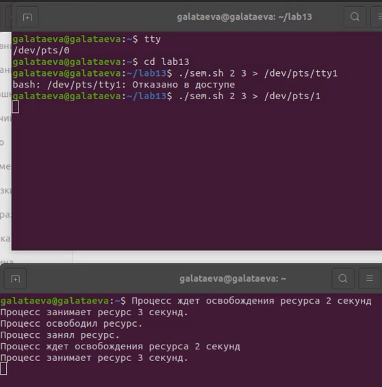
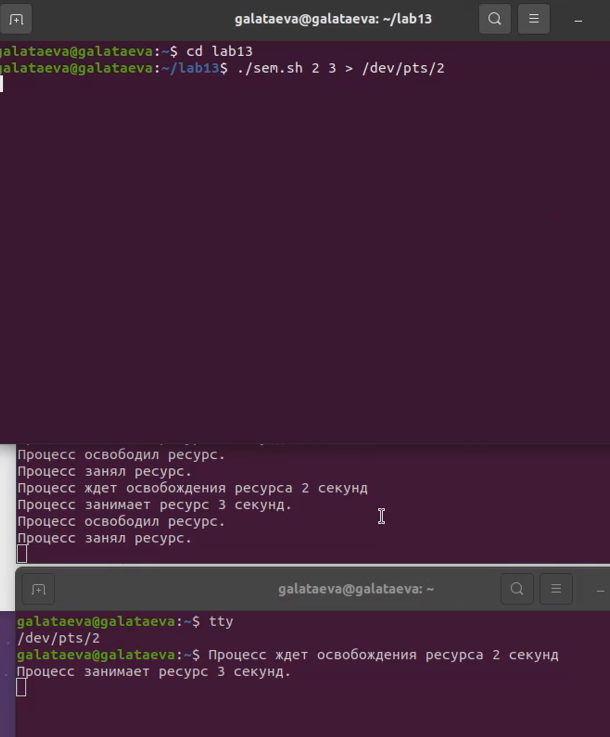
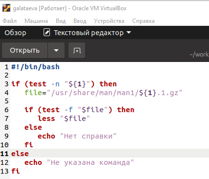
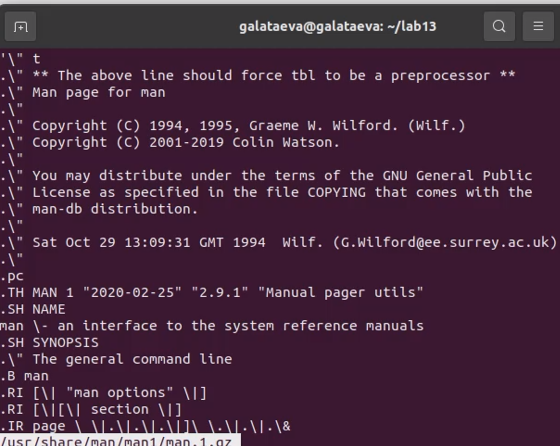
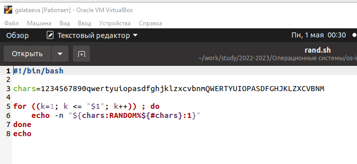
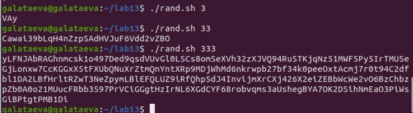

---
## Front matter
title: "Отчёт по лабораторной работе №13"
subtitle: "дисциплина: Операционные системы"
author: "Латаева Гюзелия Андреевна"

## Generic otions
lang: ru-RU
toc-title: "Содержание"

## Bibliography
bibliography: bib/cite.bib
csl: pandoc/csl/gost-r-7-0-5-2008-numeric.csl

## Pdf output format
toc: true # Table of contents
toc-depth: 2
lof: true # List of figures
lot: true # List of tables
fontsize: 12pt
linestretch: 1.5
papersize: a4
documentclass: scrreprt
## I18n polyglossia
polyglossia-lang:
  name: russian
  options:
	- spelling=modern
	- babelshorthands=true
polyglossia-otherlangs:
  name: english
## I18n babel
babel-lang: russian
babel-otherlangs: english
## Fonts
mainfont: PT Serif
romanfont: PT Serif
sansfont: PT Sans
monofont: PT Mono
mainfontoptions: Ligatures=TeX
romanfontoptions: Ligatures=TeX
sansfontoptions: Ligatures=TeX,Scale=MatchLowercase
monofontoptions: Scale=MatchLowercase,Scale=0.9
## Biblatex
biblatex: true
biblio-style: "gost-numeric"
biblatexoptions:
  - parentracker=true
  - backend=biber
  - hyperref=auto
  - language=auto
  - autolang=other*
  - citestyle=gost-numeric
## Pandoc-crossref LaTeX customization
figureTitle: "Рис."
tableTitle: "Таблица"
listingTitle: "Листинг"
lofTitle: "Список иллюстраций"
lotTitle: "Список таблиц"
lolTitle: "Листинги"
## Misc options
indent: true
header-includes:
  - \usepackage{indentfirst}
  - \usepackage{float} # keep figures where there are in the text
  - \floatplacement{figure}{H} # keep figures where there are in the text
---
# Цель работы

Изучить основы программирования в оболочке ОС UNIX. Научиться писать более сложные командные файлы с использованием логических управляющих конструкций и циклов.

# Задание

1. Написать командный файл, реализующий упрощённый механизм семафоров. Командный файл должен в течение некоторого времени t1 дожидаться освобождения ресурса, выдавая об этом сообщение, а дождавшись его освобождения, использовать его в течение некоторого времени t2<>t1, также выдавая информацию о том, что ресурс используется соответствующим командным файлом (процессом). Запустить командный файл в одном виртуальном терминале в фоновом режиме, перенаправив его вывод в другой (> /dev/tty#, где # — номер терминала куда перенаправляется вывод), в котором также запущен этот файл, но не фоновом, а в привилегированном режиме. Доработать программу так, чтобы имелась возможность взаимодействия трёх и более процессов.

2. Реализовать команду man с помощью командного файла. Изучите содержимое каталога /usr/share/man/man1. В нем находятся архивы текстовых файлов, содержащих справку по большинству установленных в системе программ и команд. Каждый архив можно открыть командой less сразу же просмотрев содержимое справки. Командный файл должен получать в виде аргумента командной строки название команды и в виде результата выдавать справку об этой команде или сообщение об отсутствии справки, если соответствующего файла нет в каталоге man1.

3. Используя встроенную переменную $RANDOM, напишите командный файл, генерирующий случайную последовательность букв латинского алфавита.

# Выполнение лабораторной работы

**Задание 1.**

1. Создала файл sem.sh и устанавливаю ему права на выполнение.

2. Написала командный файл реализующий упрощённый механизм семафоров:(рис. @fig:001)

{#fig:001 width=70%}

3. Результат после выполнения: (рис. @fig:002), (рис. @fig:003)

{#fig:002 width=70%}

{#fig:003 width=70%}

**Задание 2.**

1. Создала файл new_man.sh и устанавливаю ему права на выполнение. 

2. Написала командный файл, реализующий команду man. Командный файл должен получать в виде аргумента командной строки название команды и в виде результата выдавать справку об этой команде: (рис. @fig:004)

{#fig:004 width=70%}

3. Выполнила скрипт и получила результат: (рис. @fig:005):

{#fig:005 width=70%}

**Задание 3.**

1. Создала файл rand.sh и устанавливаю ему права на выполнение.

2. Написала командный файл, генерирующий случайную последовательность букв латинского алфавита (рис. @fig:006):

{#fig:006 width=70%}

3. Выполнила скрипт и получила результат: (рис. @fig:007):

{#fig:007 width=70%}

# Выводы

Я изучила основы программирования в оболочке ОС UNIX и научилась писать более сложные командные файлы с использованием логических управляющих конструкций и циклов.

# Контрольные вопросы
1. Найдите синтаксическую ошибку в следующей строке: while [ $ 1 != "exit"]

Вместо квадратных скобок [ ] нужно использовать круглые скобки (( )).

2. Как объединить (конкатенация) несколько строк в одну?

Использовать оператор +=.

3. Найдите информацию об утилите seq. Какими иными способами можно реализовать её функционал при программировании на bash?

Seq генерирует последовательность чисел. Может использоваться для создания циклов и других задач, которые требуют генерации последовательностей чисел.

4. Какой результат даст вычисление выражения $((10/3))?

Целое число 3.

5. Укажите кратко основные отличия командной оболочки zsh от bash.

Отличия:

- Автодополнение (completion) в zsh работает более интеллектуально, подсказывая аргументы команд, опции и параметры на основе контекста ввода.

- Встроенная поддержка для расширенной истории команд, которая позволяет повторять и редактировать команды из истории более эффективно, чем в bash.

- Мощная система управления заданиями, которая позволяет управлять заданиями более гибко, чем в bash.

- Встроенная поддержка сжатия (компрессии) и декомпрессии файлов.

- Синтаксис именования переменных и замены подстановок в zsh более гибкий и мощный, чем в bash.

- Zsh поддерживает концепцию «фреймов», которые могут быть использованы для создания виртуальных окружений и управления локальными настройками командной оболочки.

- Zsh имеет множество встроенных функций, которые упрощают работу с файлами и строками.

- Bash является более широко используемой командной оболочкой и, следовательно, имеет более обширную документацию и большее количество пользовательских скриптов и плагинов.

6. Проверьте, верен ли синтаксис данной конструкции for ((a=1; a <= LIMIT; a++))

Все корректно, если переменная LIMIT заранее определена. Если LIMIT не определена, будет ошибка.

7. Сравните язык bash с какими-либо языками программирования. Какие преимущества у bash по сравнению с ними? Какие недостатки?

Bash является языком командной строки, который используется для автоматизации и автоматизации выполнения задач в операционной системе Linux. В отличие от некоторых языков программирования, таких как C++ или Java, Bash имеет более простой синтаксис и специализ

# Список литературы{.unnumbered}

1. ya.ru
