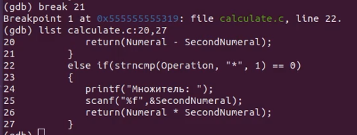

---
## Front matter
title: "Отчёт по лабораторной работе №14"
subtitle: "дисциплина: Операционные системы"
author: "Латаева Гюзелия Андреевна"

## Generic otions
lang: ru-RU
toc-title: "Содержание"

## Bibliography
bibliography: bib/cite.bib
csl: pandoc/csl/gost-r-7-0-5-2008-numeric.csl

## Pdf output format
toc: true # Table of contents
toc-depth: 2
lof: true # List of figures
lot: true # List of tables
fontsize: 12pt
linestretch: 1.5
papersize: a4
documentclass: scrreprt
## I18n polyglossia
polyglossia-lang:
  name: russian
  options:
	- spelling=modern
	- babelshorthands=true
polyglossia-otherlangs:
  name: english
## I18n babel
babel-lang: russian
babel-otherlangs: english
## Fonts
mainfont: PT Serif
romanfont: PT Serif
sansfont: PT Sans
monofont: PT Mono
mainfontoptions: Ligatures=TeX
romanfontoptions: Ligatures=TeX
sansfontoptions: Ligatures=TeX,Scale=MatchLowercase
monofontoptions: Scale=MatchLowercase,Scale=0.9
## Biblatex
biblatex: true
biblio-style: "gost-numeric"
biblatexoptions:
  - parentracker=true
  - backend=biber
  - hyperref=auto
  - language=auto
  - autolang=other*
  - citestyle=gost-numeric
## Pandoc-crossref LaTeX customization
figureTitle: "Рис."
tableTitle: "Таблица"
listingTitle: "Листинг"
lofTitle: "Список иллюстраций"
lotTitle: "Список таблиц"
lolTitle: "Листинги"
## Misc options
indent: true
header-includes:
  - \usepackage{indentfirst}
  - \usepackage{float} # keep figures where there are in the text
  - \floatplacement{figure}{H} # keep figures where there are in the text
---
# Цель работы

Приобрести простейшие навыки разработки, анализа, тестирования и отладки приложений в ОС типа UNIX/Linux на примере создания на языке программирования С калькулятора с простейшими функциями.

# Задание

1. В домашнем каталоге создайте подкаталог ~/work/os/lab_prog.

2. Создайте в нём файлы: calculate.h, calculate.c, main.c. Это будет примитивнейший калькулятор, способный складывать, вычитать, умножать и делить, возводить число в степень, брать квадратный корень, вычислять sin, cos, tan. При запуске он будет запрашивать первое число, операцию, второе число. После этого программа выведет результат и остановится.

3. Выполните компиляцию программы посредством gcc:

gcc -c calculate.c

gcc -c main.c

gcc calculate.o main.o -o calcul -lm

4. При необходимости исправьте синтаксические ошибки.

5. Создать Makefile.

6. С помощью gdb выполните отладку программы calcul (перед использованием gdb исправьте Makefile):

– Запустите отладчик GDB, загрузив в него программу для отладки: gdb ./calcul

– Для запуска программы внутри отладчика введите команду run: run

– Для постраничного (по 9 строк) просмотра исходного код используйте команду list: list

– Для просмотра строк с 12 по 15 основного файла используйте list с параметрами: list 12,15

– Для просмотра определённых строк не основного файла используйте list с параметрами: list calculate.c:20,29

– Установите точку останова в файле calculate.c на строке номер 21: 

list calculate.c:20,27 

break 21

– Выведите информацию об имеющихся в проекте точка останова: info breakpoints

– Запустите программу внутри отладчика и убедитесь, что программа остановится в момент прохождения точки останова: run

5

-

backtrace

– Посмотрите, чему равно на этом этапе значение переменной Numeral, введя: print Numeral (на экран должно быть выведено число 5).

– Сравните с результатом вывода на экран после использования команды: display Numeral

– Уберите точки останова: 

info breakpoints

delete 1

7. С помощью утилиты splint попробуйте проанализировать коды файлов calculate.c и main.c

# Выполнение лабораторной работы

1. В домашнем каталоге я создала подкаталог ~/work/os/lab_prog и создала в нём файлы: calculate.h, calculate.c, main.c и заполнила их кодом из задания:(рис. @fig:001), (рис. @fig:002), (рис. @fig:003)

{#fig:001 width=70%}

{#fig:002 width=70%}

{#fig:003 width=70%}

2. Выполнила компиляцию программы посредством gcc:

gcc -c main.c и gcc calculate.o main.o -o calcul -lm: (рис. @fig:004)

{#fig:004 width=70%}

gcc -c calculate.c: (рис. @fig:005)

{#fig:005 width=70%}

3. Создала Makefile со следующим содержанием: (рис. @fig:006)

{#fig:006 width=70%}

CC = gcc - создание переменной компилятора CC

CFLAGS = - создание переменной флагов компиляции CFLAGS

LIBS = -lm - создание переменной библиотек LIBS

calcul: calculate.o main.o. - описывается процесс создания исполняемого файла calcul, зависящего от файлов calculate.o и main.o

gcc calculate.o main.o -o calcul $(LIBS) - сборка файла calcul

calculate.o: calculate.c calculate.h - описывается процесс создания исполняемого файла calculate.o, зависящего от файлов calculate.c и calculate.h

gcc -c calculate.c $(CFLAGS): сборка файла calculate.o

main.o: main.c calculate.h: описывается процесс создания исполняемого файла main.o, зависящего от файлов main.c и calculate.h

gcc -c main.c $(CFLAGS): сборка файла main.o

clean: -rm calcul *.o *~: очистка всех созданных файлов и объектов.

4.  С помощью gdb выполнила отладку программы calcul:

– запустила отладчик GDB, загрузив в него программу для отладки: gdb ./calcul (рис. @fig:007)

{#fig:007 width=70%}

– для запуска программы внутри отладчика ввела команду run: (рис. @fig:008)

{#fig:008 width=70%}

– использовала команду list для постраничного просмотра исходного кода: (рис. @fig:009)

{#fig:009 width=70%}

– для просмотра строк с 12 по 15 основного файла использовала list 12,15: (рис. @fig:010)

{#fig:010 width=70%}

– для просмотра определённых строк не основного файла использовала list calculate.c:20,29: (рис. @fig:011)

{#fig:011 width=70%}

– установила точку останова в файле calculate.c на строке номер 21: (рис. @fig:012)

{#fig:012 width=70%}

– вывела информацию об имеющихся в проекте точек останова: (рис. @fig:013)

{#fig:013 width=70%}

– запустила программу внутри отладчика. Программа остановилась в момент прохождения точки останова: (рис. @fig:014)

{#fig:014 width=70%}

– значение переменной Numeral: (рис. @fig:015)

{#fig:015 width=70%}

– сравнила с результатом вывода на экран после использования команды: (рис. @fig:016)

{#fig:016 width=70%}

– убрала точки останова: (рис. @fig:017)

{#fig:017 width=70%}

5. Использовала утилиту splint чтобы проанализировать коды файлов calculate.c и main.c: (рис. @fig:018) (рис. @fig:019)

{#fig:018 width=70%}

{#fig:019 width=70%}

# Выводы

Я приобрела навыки разработки, анализа, тестирования и отладки приложений в ОС типа UNIX/Linux на примере создания на языке программирования С калькулятора с простейшими функциями.

# Контрольные вопросы

1. Как получить информацию о возможностях программ gcc, make, gdb и др.?

Использовать команды man и info в терминале Linux.

2. Назовите и дайте краткую характеристику основным этапам разработки приложений в UNIX.

1-Написать код на языке программирования

2-Компиляция исходного кода в исполняемый файл

3-Отладка программы

4-Создание Makefile и использование утилиты make

5-Доработка, тестирование

6- Документирование

3. Что такое суффикс в контексте языка программирования? Приведите примеры использования.

Это часть имени файла, которая указывает на его тип или назначение. Например, programm.c суффикс ".c" указывает, что это файл кода на языке программирования C.

4. Каково основное назначение компилятора языка С в UNIX?

Преобразование исходного кода программы, написанной на языке C, в машинный код, который может быть исполнен процессором компьютера.

5. Для чего предназначена утилита make?

Для автоматизации процесса сборки приложения в UNIX. 

6. Приведите пример структуры Makefile. Дайте характеристику основным элементам этого файла.

См. пункт 3 выполнения отчета.

7. Назовите основное свойство, присущее всем программам отладки. Что необходимо сделать, чтобы его можно было использовать?

Возможность управлять выполнением программы, остановка ее на определенном месте, просмотр значений переменных и выполнения команд в контексте отладки.

8. Назовите и дайте основную характеристику основным командам отладчика gdb.

backtrace - вывод на экран пути к текущей точке останова

break - установить точку останова

clear - удалить все точки останова в функции continue продолжить выполнение программы

delete - удалить точку останова

display - добавить выражение в список выражений, значения которых отображаются при достижении точки останова программы

finish - выполнить программу до момента выхода из функции

info breakpoints - вывести на экран список используемых точек останова

info watchpoints - вывести на экран список используемых контрольных выражений

list - вывести на экран исходный код (в качестве параметра может быть указано название файла и через двоеточие номера начальной и конечной строк)

next - выполнить программу пошагово, но без выполнения вызываемых в программе функций

print - вывести значение указываемого в качестве параметра выражения

run - запуск программы на выполнение

set - установить новое значение переменной

step - пошаговое выполнение программы watch установить контрольное выражение, при изменении значения которого программа будет остановлена

9. Опишите по шагам схему отладки программы, которую Вы использовали при выполнении лабораторной работы.

1-Компиляция программы с опцией -c

2-создание Makefile

3-запуск отладчика gdb, указав имя скомпилированного исполняемого файла

4-запуск run

5-посмотр исходного кода

6-установка точки останова на нужных строках кода с помощью команды break

7-запуск программы

8-исправление кода программы и повтор отладки после нахождения ошибки

10. Прокомментируйте реакцию компилятора на синтаксические ошибки в программе при его первом запуске.
11. Назовите основные средства, повышающие понимание исходного кода программы.

Комментарии, документация, отладчики, редакторы кода, программы анализа кода, руководства.

12. Каковы основные задачи, решаемые программой splint?

Это инструмент статического анализа кода на языке C, который помогает обнаруживать ошибки в коде, связанные с безопасностью и потенциальными уязвимостями.

Основные задачи: поиск ошибок в коде, анализ потока данных, проверка безопасности, проверка соответствия стандартам, улучшение качества кода.

# Список литературы{.unnumbered}

1. ya.ru

