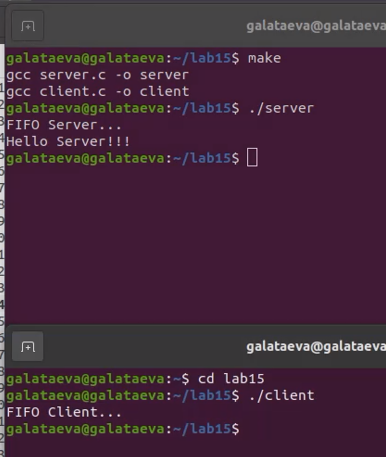
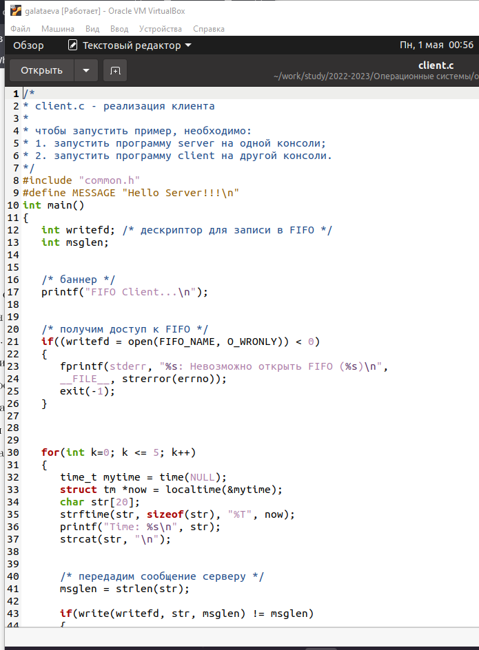
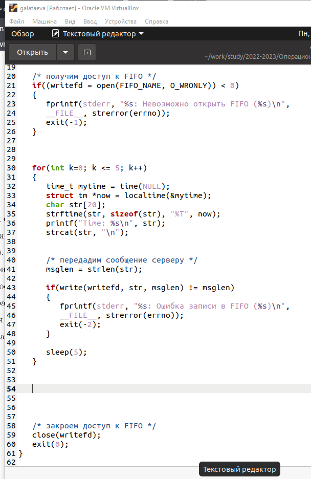
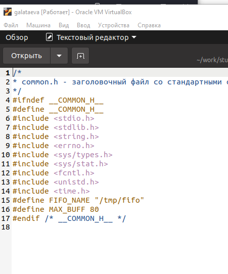
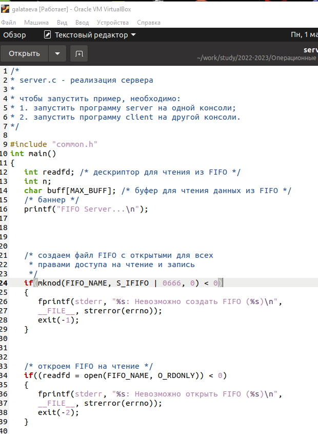
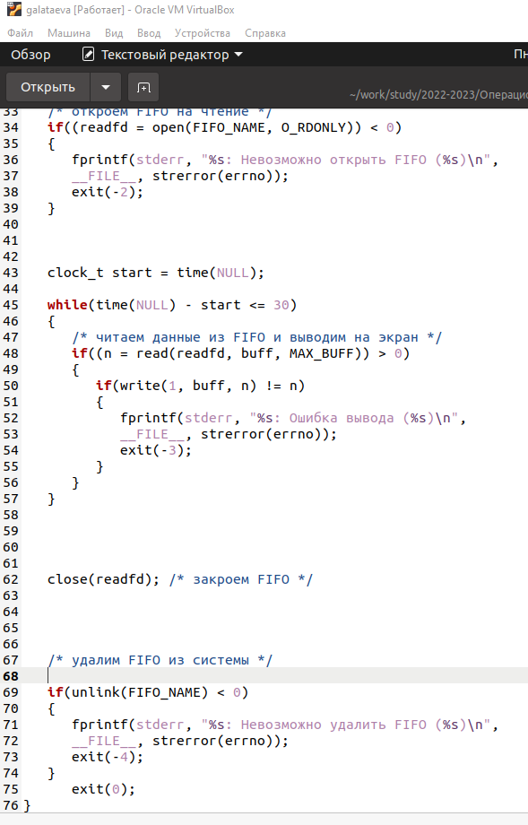
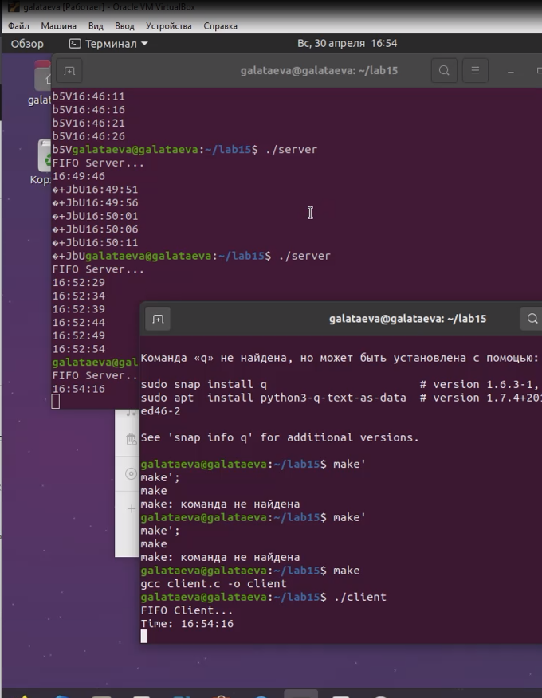
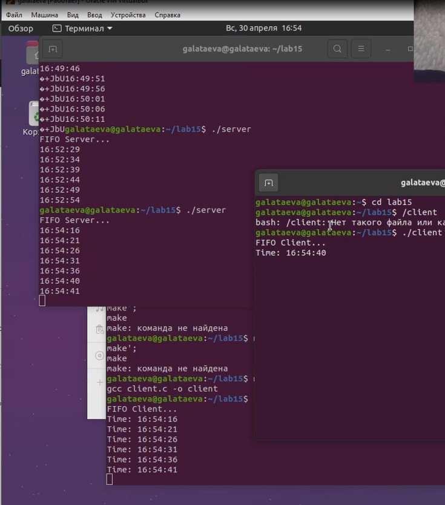

---
## Front matter
title: "Отчёт по лабораторной работе №15"
subtitle: "дисциплина: Операционные системы"
author: "Латаева Гюзелия Андреевна"

## Generic otions
lang: ru-RU
toc-title: "Содержание"

## Bibliography
bibliography: bib/cite.bib
csl: pandoc/csl/gost-r-7-0-5-2008-numeric.csl

## Pdf output format
toc: true # Table of contents
toc-depth: 2
lof: true # List of figures
lot: true # List of tables
fontsize: 12pt
linestretch: 1.5
papersize: a4
documentclass: scrreprt
## I18n polyglossia
polyglossia-lang:
  name: russian
  options:
	- spelling=modern
	- babelshorthands=true
polyglossia-otherlangs:
  name: english
## I18n babel
babel-lang: russian
babel-otherlangs: english
## Fonts
mainfont: PT Serif
romanfont: PT Serif
sansfont: PT Sans
monofont: PT Mono
mainfontoptions: Ligatures=TeX
romanfontoptions: Ligatures=TeX
sansfontoptions: Ligatures=TeX,Scale=MatchLowercase
monofontoptions: Scale=MatchLowercase,Scale=0.9
## Biblatex
biblatex: true
biblio-style: "gost-numeric"
biblatexoptions:
  - parentracker=true
  - backend=biber
  - hyperref=auto
  - language=auto
  - autolang=other*
  - citestyle=gost-numeric
## Pandoc-crossref LaTeX customization
figureTitle: "Рис."
tableTitle: "Таблица"
listingTitle: "Листинг"
lofTitle: "Список иллюстраций"
lotTitle: "Список таблиц"
lolTitle: "Листинги"
## Misc options
indent: true
header-includes:
  - \usepackage{indentfirst}
  - \usepackage{float} # keep figures where there are in the text
  - \floatplacement{figure}{H} # keep figures where there are in the text
---
# Цель работы

Приобретение практических навыков работы с именованными каналами.

# Задание

Изучить приведённые в тексте лаборатоной работы программы server.c и client.c. Взяв данные примеры за образец, написать аналогичные программы, внеся следующие изменения:

1. Работает не 1 клиент, а несколько (например, два).

2. Клиенты передают текущее время с некоторой периодичностью (например, раз в пять секунд). Используйте функцию sleep() для приостановки работы клиента.

3. Сервер работает не бесконечно, а прекращает работу через некоторое время (например, 30 сек). Используйте функцию clock() для определения времени работы сервера. Что будет в случае, если сервер завершит работу, не закрыв канал?

# Выполнение лабораторной работы

Я изучила приведённые в тексте программы и посмотрела их работу: (рис. @fig:001)

{#fig:001 width=70%}

Далее я в каждый файл внесла соответствующие изменения, чтобы предоставить в программе работу нескольким пользователям, которые раз в 5 секунд будут передавать текущее время, а сам сервер прекращает свою работу через 30 секунд: 

- файл client.c: (рис. @fig:002), (рис. @fig:003)

{#fig:002 width=70%}

{#fig:003 width=70%}

- файл common.h: (рис. @fig:004)

{#fig:004 width=70%}

- файл server.c: (рис. @fig:005), (рис. @fig:006)

{#fig:005 width=70%}

{#fig:006 width=70%}

Результат работы с одним пользоваетем (рис. @fig:007) и двумя (рис. @fig:008)

{#fig:007 width=70%}

{#fig:008 width=70%}

Если же завершить работу сервера и при этом не закрыть канал FIFO, то клиент может зависнуть в ожидании ответа от сервера. 

# Выводы

Я приобрела практические навыки работы с именованными каналами.

# Контрольные вопросы

1. В чем ключевое отличие именованных каналов от неименованных?

Именованные каналы отличаются от неименованных наличием имени, то есть идентификатора канала, потенциально видимого всем процессам системы. Именованный программный канал может служить для общения и синхронизации произвольных процессов, знающих имя данного программного канала и имеющих соответствующие права доступа. Неименованным программным каналом могут пользоваться только создавший его процесс и его потомки (необязательно прямые).

2. Возможно ли создание неименованного канала из командной строки?

Нет.

3. Возможно ли создание именованного канала из командной строки?

Да.

4. Опишите функцию языка С, создающую неименованный канал.

Функция pipe(). Она принимает в качестве аргумента массив из двух целых чисел: pipefd[0] - чтение из канала и pipefd[1] - запись в канал. Функция возвращает 0 в случае успешного выполнения и -1 в случае ошибки.

5. Опишите функцию языка С, создающую именованный канал.

Функция mkfifo(). Она в качестве аргумента передается путь к создаваемому каналу и права доступа. Функция возвращает 0 в случае успешного выполнения и -1 в случае ошибки.

6. Что будет в случае прочтения из fifo меньшего числа байтов, чем находится в канале? Большего числа байтов?

В первом случае процесс блокируется до тех пор, пока в канале не появятся новые данные. Во втором процесс блокируется до тех пор, пока другой процесс не запишет новые данные в канал.

7. Аналогично, что будет в случае записи в fifo меньшего числа байтов, чем позволяет буфер? Большего числа байтов?

В первом случае данные записываются в буфер частично. Во втором процесс блокируется до тех пор, пока другой процесс не прочтет часть данных из канала и не освободит место в буфере.

8. Могут ли два и более процессов читать или записывать в канал?

Да.

9. Опишите функцию write (тип возвращаемого значения, аргументы и логику работы). Что означает 1 (единица) в вызове этой функции в программе server.c (строка 42)?

Она используется для записи данных в файловый дескриптор и возвращает количество записанных байтов или -1 в случае ошибки.

10. Опишите функцию strerror.

Используется для получения строки с описанием ошибки, связанной с кодом ошибки. 

# Список литературы{.unnumbered}

1. ya.ru

